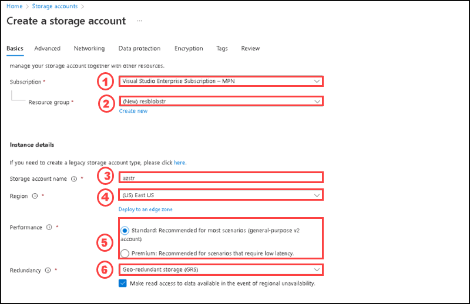
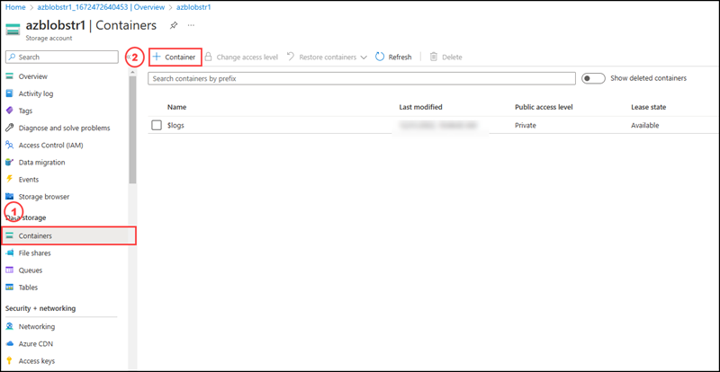
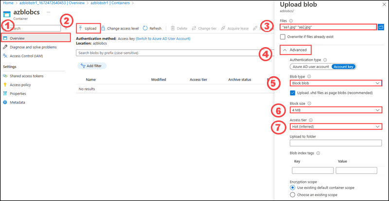
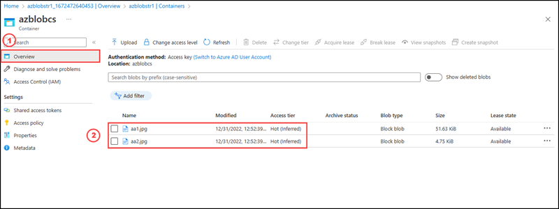
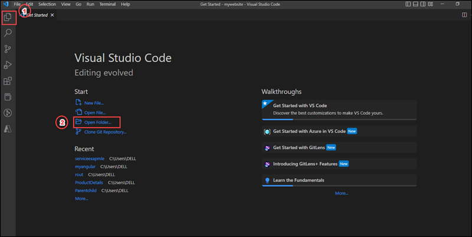
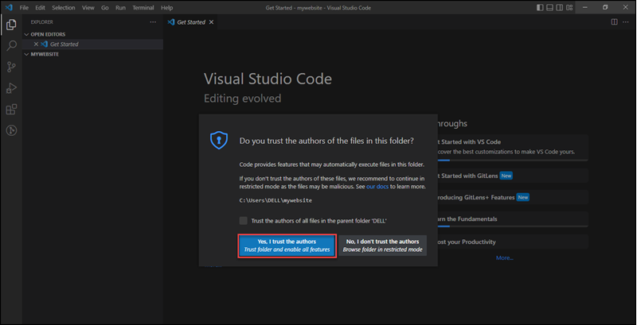
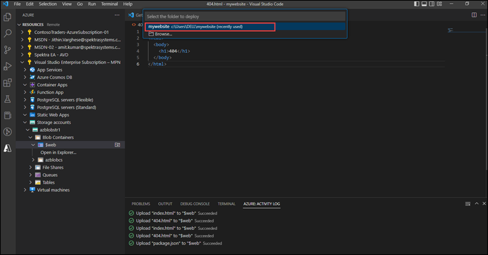
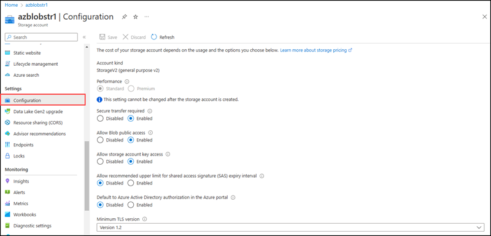
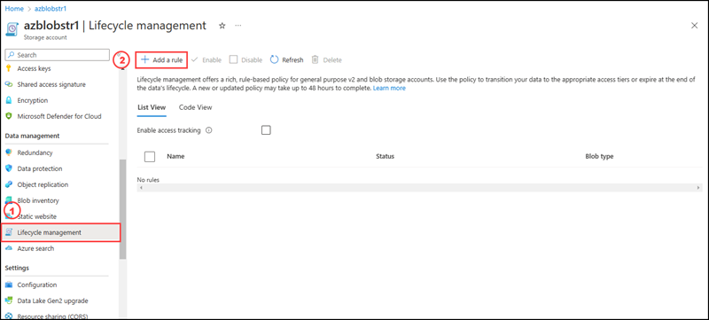

## Instructions

## Exercise 1: Create Storage account and configure a static website to access the blob container and apply lifecycle management policy

### Task 1: Create an Azure Storage account

In this task, you will learn how to use Azure portal to create an azure storage account.

#### Pre-requisites for this task

An Azure account

#### Steps

1. Double click on the Edge browser icon from the desktop.

2. Enter the login credentials. For credentials, please see the environment details tab on the lab guide.

3. Once the portal opened completely, click on all services on the left portal menu and select storage accounts

4. On the storage accounts page please select create, 

5. Create a Storage account page will open. You can see the options for your new storage account are organized into tabs in the Create a storage account page.

6. Basic tab shows a standard configuration of the basic properties for a new storage account. On the basic tab, select the subscription, if the default subscription is not using, then create a new resource group.

7. For Storage account name option please provide any name with small letter alphabets and numbers.

8. Select the region option as East US

9. On the performance options: Select standard

10. Select Geo-Redundant storage on the redundancy option

11. Go to Advanced tab, review the options and the default values of it. Please dont change any values.

12. Go to Networking tab, and review the options and the default values of it.

13. Go to Data Protection tab, and review the options and the default values of it.

14. Go to Encryption tab, and review the options and the values.

15. After reviewing all tabs, select the review button from the bottom left of the page.

16. After completing the validation, please click on Create button from the bottom left of the page.

17. After completing the deployment, Please click on **Go to resource**.

18. You can see the newly created Storage account, please go through the overview section.

### Task 2: Create a blob container

In this task, you will learn how to use the Azure portal to create a blob container in a storage account.

#### Pre-requisites for this task

An Azure account, a storage account (Complete Task 1)

#### Steps

1. Navigate to your new storage account in the Azure portal.

2. In the left menu for the storage account, scroll to the Data storage section, then select Containers.

3. Select the + Container button.

4. Type a name for your new container. The container name must be lowercase, must start with a letter or number, and can include only letters, numbers, and the dash (-) character. For more information about container and blob names, see Naming and referencing containers, blobs, and metadata.

5. Set the level of public access to the container. The default level is Private (no anonymous access).

6. Select Create to create the container.

7. After completing the deployment, you can see the newly created blob container on the container's section, If its not listed please refresh the page.

### Task 3: Upload a block blob

In this task, you will learn how to use the Azure portal to upload a block blob in your newly created blob container in a storage account.

#### Pre-requisites for this task

An Azure account, a storage account (Complete Task 1), an azure blob container (Complete Task 1 & Task 2). To upload a block blob to your new container in the Azure portal, follow these steps:

#### Steps

1. In the Azure portal, navigate to the container you created in the previous task.

2. Select the container to show a list of blobs it contains. This container is new, so it won't yet contain any blobs.

3. Select the Upload button to open the upload blade and browse your local file system to find a file to upload as a block blob ( you can upload multiple files). You can optionally expand the Advanced section to configure other settings for the upload operation. 

4. After entering all the details, please select the upload button to upload the blob.

5. After completing the uploading process of block blobs, you can see the blobs listed in the container. If its not seeing, Please select the overview tab of the container and select refresh.

### Task 4: Configure a static website to access the blob container

In this task, you will learn how to use the Azure portal to configure a static website to access the blob container.

#### Pre-requisites for this task

An Azure account, a storage account (Complete Task 1), an azure blob container (Complete Task 1 & Task 2). To configure a static website to access the blob container, follow these steps:

#### Steps

1. Launch Visual Studio Code by double click on Vscode icon from desktop.

2. On the toolbar, click Extensions. Search for Azure Storage, and select the Azure Storage extension from the list. Then click the Install button to install the extension.

3. Open the Azure portal in your web browser.

4. Locate your storage account and display the account overview.

5. Select Static website to display the configuration page for static websites under data management section.

6. Select Enabled to enable static website hosting for the storage account.

7. In the Index document name field, specify a default index page of index.html. The default index page is displayed when a user navigates to the root of your static website.

8. In the Error document path field, specify a default error page of 404.html. The default error page is displayed when a user attempts to navigate to a page that does not exist in your static website. Click Save.

9. The Azure portal now displays your static website endpoints (primary and secondary). Azure Storage automatically creates a container named $web. The $web container will contain the files for your static website.

Next, create a Hello World web page with Visual Studio Code and deploy it to the static website hosted in your Azure Storage account.

10. Create an empty folder named mywebsite on your local file system.

11. Launch Visual Studio Code, and open the folder that you just created from the Explorer panel, by selecting open folder option.

12. Select Yes, I trust the authors Trust folder and enable all features.

13. Create the default index file in the mywebsite folder, by selecting Add file option and provide the name index.html in the name box.

14. Open index.html in the editor, paste the following text into the file, and save it:

15. Create the default error file and name it 404.html.

16. Open 404.html in the editor, paste the following text into the file, and save it:

17. Click on the Azure logo where you will be asked to log in. Once you have authenticated to Azure with the extension, right-click on the $web storage container under  —>  –> Blob Containers as you can see below. You’ll then see an option to Deploy to Static Website. Select that option.

18. Choose the folder containing the two files mentioned earlier. 

19. Visual Studio Code will then deploy those files as your static page and return a success message to you. Please select  Browse to website button.Or Once the files have been uploaded, navigate to the primary endpoint you received earlier.

20. This is the index.html page you uploaded through Visual studio code. Now you can see it in as Azure hosted static website.

### Task 5: Apply the lifecycle Management Policy

In this task, you will learn how to use the Azure portal to Apply the lifecycle management policy of a storage account. Azure Storage lifecycle management offers a rule-based policy that you can use to transition blob data to the appropriate access tiers or to expire data at the end of the data lifecycle. A lifecycle policy acts on a base blob, and optionally on the blob's versions or snapshots. For example, if you have defined an action to move a blob from the hot tier to the cool tier if it has not been modified for 30 days, then the lifecycle management policy will move the blob 30 days after the last write operation to that blob.

#### Pre-requisites for this task

An Azure account, a storage account (Complete Task 1), an azure blob container (Complete Task 1 & Task 2). Before doing the steps to configure Lifecycle management policy, please go to the storage account created on the previous task and select configuration under settings to view the configuration of your storage account, which you are going to apply Lifecycle management policy.

#### Steps

1. Go to Lifecycle management under Data management of the storage account created on the previous task. Please select Add rule.

2. On the Add a rule page please enter the rule name as Testrule and keep the default settings as it is and select Next

3. On the Add a rule page, under the Base blob tab, enter the following settings as per the image below: and please select add button.

4. You have now created your lifecycle management policy for storage blobs, after 30 days, your storage blobs will be moved to the cool access tier.

If you are not seeing newly created lifecycle management policy please select the lifecycle management and select refresh.
