## Instructions

## Exercise 2: Secure blob storage and enable backup and soft delete

Securing access to your Blob storage is a critical step for any Azure administrator or engineer. In this exercise, you will learn how to use the Azure portal to secure your blob storage and enable backup and soft delete.

In this Exercise, you will have:

+ Task 1: Configure storage account to use a customer-managed key stored in a Key Vault.
+ Task 2: To secure your blob storage you can configure Shared Access Signatures (SAS).
+ Task 3: Enable Soft delete.
+ Task 4: Configure Backup Vault.
+ Task 5: Configure the Storage account backup contributor role.
+ Task 6: Configure Backup.

## Estimated timing: 80 minutes

### Task 1: Configure storage account to use a customer-managed key stored in a Key Vault

By default, storage accounts encrypt the data using Microsoft-managed keys. You can continue using these Microsoft-managed keys for data encryption, or you can manage encryption using your keys.

If you choose to use your own encryption keys, you have two options, and you can use either type of key management or both.

Use a customer-managed key. These keys must be stored in an Azure Key Vault.

Use a customer-provided key. These keys are used for Blob storage operations. A client who makes read or write requests against Blob storage can use an encryption key on the request. This method provides granular control over how blob data is encrypted and decrypted.

#### Pre-requisites for this task

The following steps outline available security features to help you configure your Blob storage to be secured.

#### Steps

To configure a storage account to use a customer-managed key stored in a Key Vault:

1. If creating a new Key Vault, place the Key Vault in the same region as the storage account and enable purge protection. If you have an existing key vault, go to the Key Vault’s Settings, then choose Properties to enable purge protection.

    Create a Key Vault if you don’t have an existing one available. Check out the following quickstart on creating a key vault using the Azure portal.

    1. Open Azure portal, in the Search box, enter **Key Vault**.
    
    2. From the results list, choose Key Vault.
    
        
    
    3. On the Key Vault section, choose **Create**.

        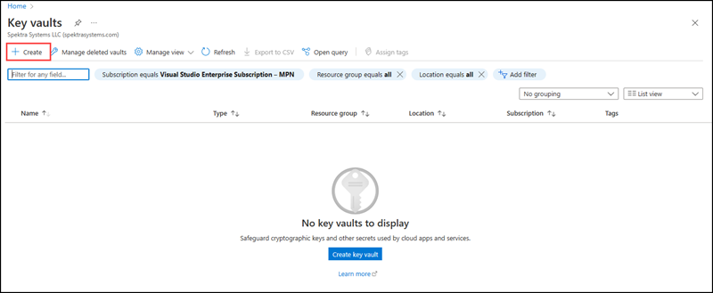
    
    4. On the Create a key vault page provide the following information:
        
        | Settings | Values |
        |  -- | -- |
        | Name | **contoso-vault-<inject key="Deployment-id" enableCopy="false" />** |
        | Subscription | **Choose a subscription** |
        | Resource group | **Select the previously created resource group** |       
        | Region | **choose a location (East US where your storage account located)**|           
                      
        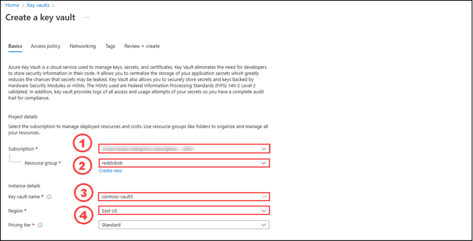          
              
    5. **Choose to enable purge protection.** **Leave the other options to their defaults.** After providing the values, select Review + Create.

        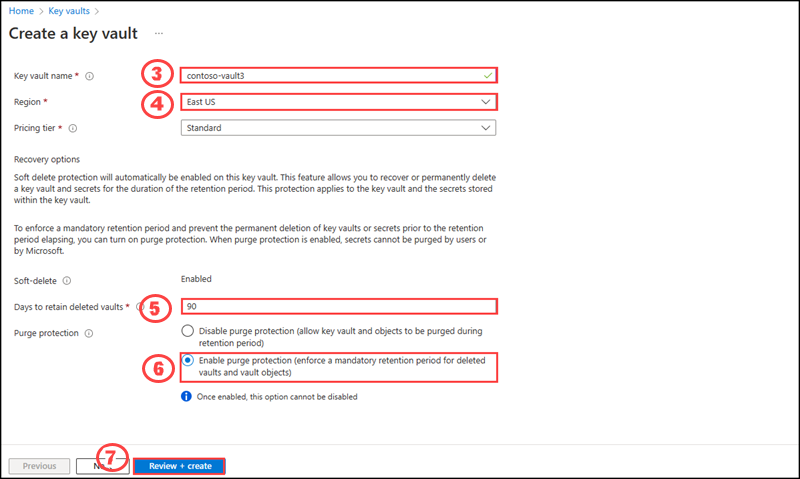
    
    6. After the validation is complete, please select **Create**.

    7. Once the deployment is complete, please select **Go to resource** .
   
   Take note of the two properties listed below:

   >**Vault Name: In the example, this is contoso-vault3. You will use this name for other steps.**
      
   >**Vault URI: In the example, this is https://contoso-vault3.vault.azure.net/. Applications that use your vault through its REST API must use this URI.**
      
    At this point, your Azure account is the only one authorized to perform operations on this new vault

3. In the storage account, navigate to **Security + Networking**, then choose **Encryption**.

4. For Encryption type, select the radio button for Customer-managed keys.

5. For the Key selection, ensure the Select from key vault value is selected, then choose the link for Select a key vault and key.

    

6. In the Select a key page, select the **Subscription**, **key store type**, and **key vault** to store the customer-managed encryption key. If you have an existing key stored in the key vault, select the key from the dropdown. Otherwise, select **Create a new key**

    

7. On the Create a Key page, select Generate for the options dropdown list, enter name as **contosostr345-key**, keep the default settings as it is and please select **Create** button.

    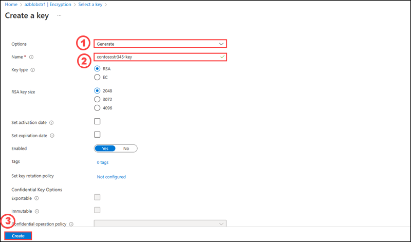

8. In the Select a key window, ensure the newly created key is selected in the Key dropdown, then click **Select**.

    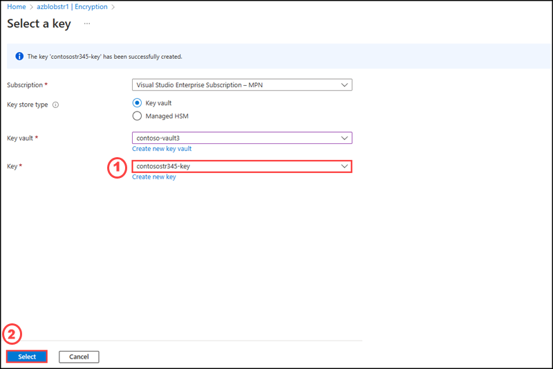

9. Back in the **Encryption** settings, click **Save**.

    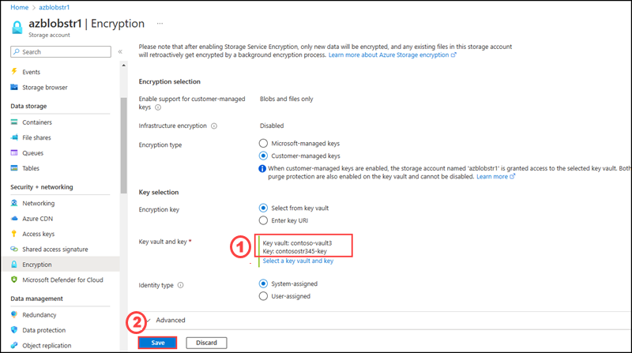

### Task 2: To secure your blob storage you can configure Shared Access Signatures (SAS)

Shared access signatures work through a signed URI that includes a token and a set of query parameters. The token determines which resources the client can access. To create a shared access signature:

#### Steps to configure shared access signatures as follows:

1. Navigate to the storage account in the Azure portal.

2. In the storage account, navigate to **Security + networking**, then choose **Shared access signature**.

    

3. In the Shared access signature pane, choose the storage account services and options the shared access signature should have. This example gives Read and List permissions to Blobs in a container. Always use the principle of least privilege when assigning permissions to a SAS. Please select the options as per the below image

    

4. Choose a start and end time for how long the SAS should be valid.

5. If needed, you can also limit what IP addresses can send requests to the storage account using the SAS.

6. As a best practice, only allow the HTTPS protocol when using the SAS URI.

7. Finally, choose which access key to sign the shared access signature. If you revoke the access key, any shared access signature created from the access key is invalidated.

8. Once you configured all the options, then select **Generate SAS and connection string**.

    

9. The wizard produces three options for using the SAS: a connection string for applications, a SAS token, and a Blob service SAS URL.

    

By providing the SAS, you can control what resources they have access to, what permissions they have on those resources, and how long they have access to the resources.

### Task 3: Enable Soft delete

By enabling Soft delete you can protect your data from accidental deletion. With the following steps you can easily configure soft delete for your blob storage.

#### Steps

1. In the Azure portal, navigate to your storage account which you have created on previous task.

2. Locate the **Data Protection** option under **Data management**.

3. In the **Recovery** section, check **Enable soft delete for blobs** option.

    

4. Specify a retention period between 1 and 365 days. Microsoft recommends a minimum retention period of seven days. In this example provide 8 days.
**Save** your changes.

### Task 4: Configure Backup Vault

Azure Blob backup is configured at the storage account level. As a result, operational backup protects all blobs in the storage account.

Using the Backup Center, you can configure backup for multiple storage accounts. You can also configure backup for a storage account using the Data Protection properties of the storage account. This section covers both methods for configuring backup.

Before Configuring backup, the storage account should have a Backup vault and Storage account backup contributor role.

#### Steps:

A backup vault is a management entity that stores recovery points that have been created over time and provides an interface for performing backup operations. These include on-demand backups, restores, and the creation of backup policies.

1. Type **Backup vaults** in the search box.

2. Under Services, select **Backup vaults**.

    

3. On the **Backup vaults** page, select **Create**.

    

4. Make sure the subscription is selected under Project details on the Basics tab, then select the resource group which you have created on the previous task.

5. Under Instance details, type **myVault** for the Backup vault name and choose your region of choice, in this case **East US** for your Region.

6. Now choose your Storage redundancy. Storage redundancy cannot be changed after protecting items to the vault. We recommend that if you're using Azure as a primary backup storage endpoint, continue to use the default Globally-redundant setting.

    >**Note : If you don't use Azure as a primary backup storage endpoint, choose Locally redundant, which reduces the Azure storage costs.**

    

7. Please review the options and the values, and select **Create** button to create the backup vault.

    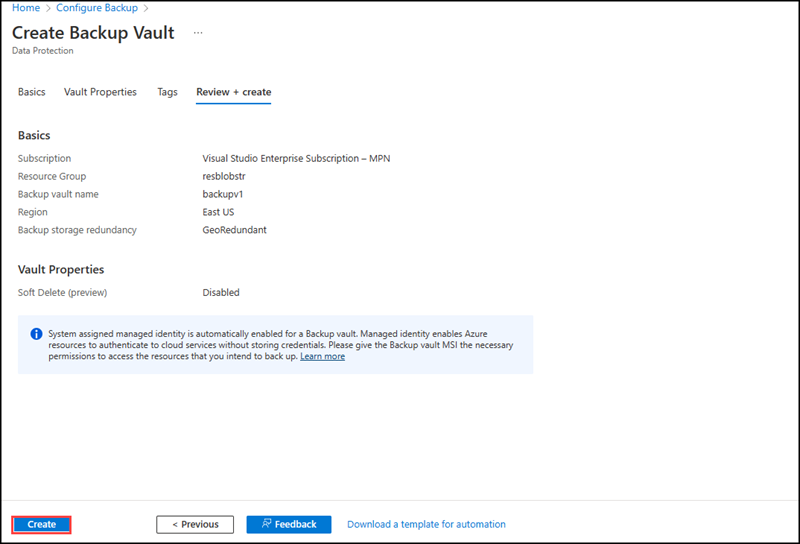

8. Please select **Go to resource**, to view the newly created backup vault.

    

9. You can see the backup vault now.

    

After creating the backup vault, you need to configure the storage account backup conrtibutor role.

### Task 5: Configure the Storage account backup contributor role 

#### Steps:

1. In the **Storage account** that needs to be protected, navigate to the **Access Control (IAM)** tab on the left navigation pane.

2. Select **Add** and then, **Add role assignments** to assign the required role.

    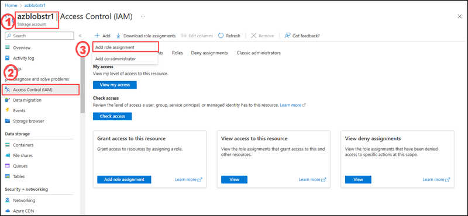

3. In the Add role assignment pane:

4. Under Role, search for **Storage Account Backup Contributor** and select the same.

    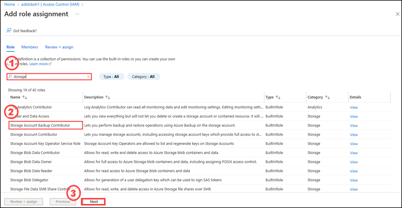

5. Under **Members** tab, on the **Assign access to** option, choose **User, group or service principal** and select **+ Select members** in the **Members** option.

    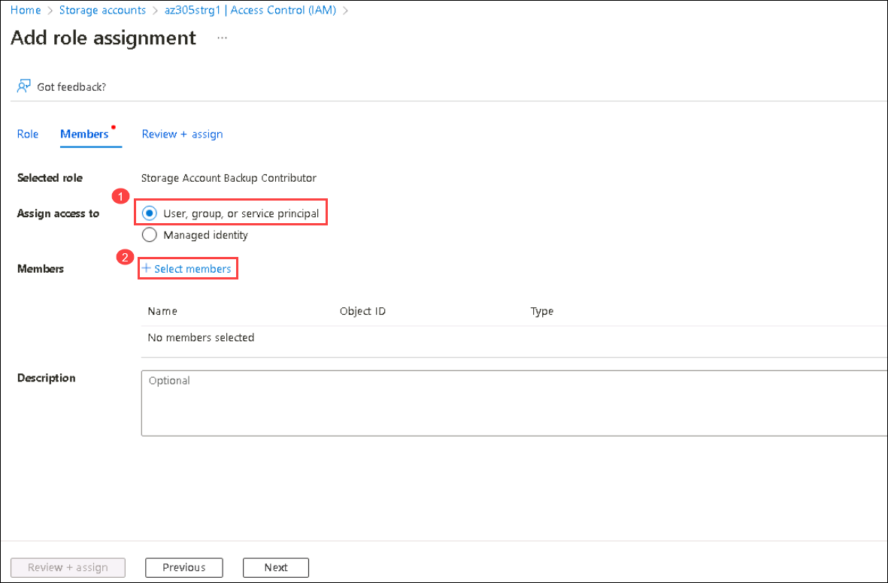

6. On the Members option, please select **+ Select members**. Under Select members side screen, Please type name of the backup vault which you created in the previous task on the search box and select the back up vault by clicking on it.

    

7. After selecting the backup vault, please select **Select** option.

    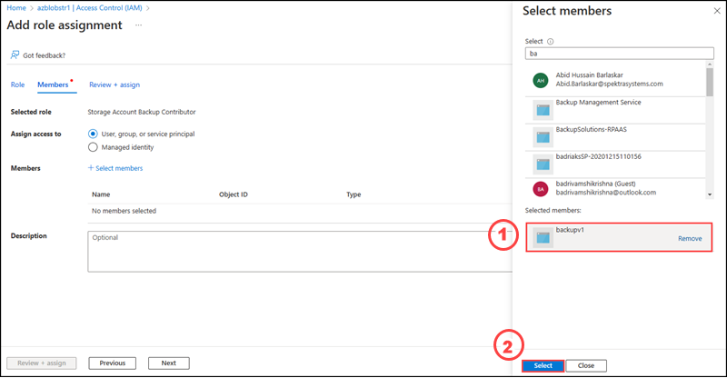

8. Please select **Next** button, then select Review **+ Assign** button.

    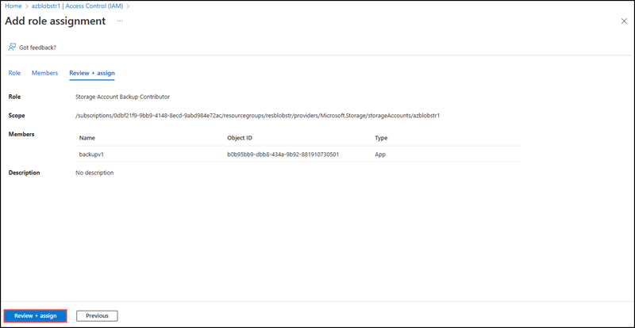

9. After completing the assigning process, please select **Role assignments** tab and you can see the newly configured storage account backup contributor role

    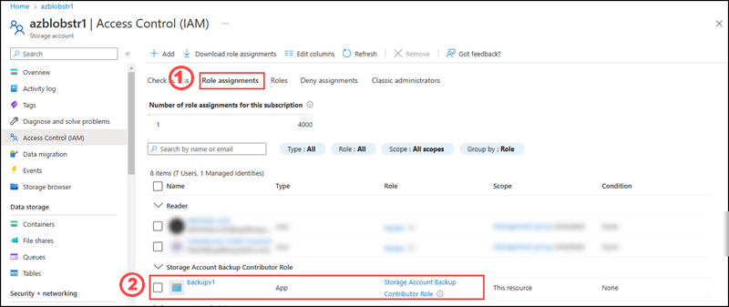

### Task 6: Configure Backup

#### Steps

To start configuring backup:

1. Search for **Backup Center** in the search bar.

    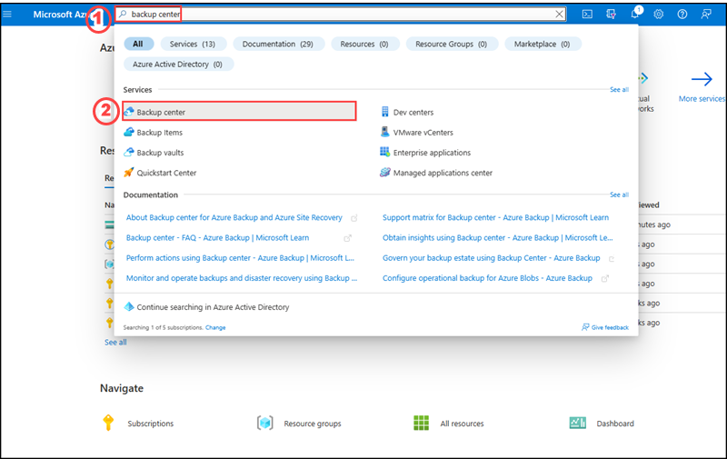

2. Navigate to **Overview -> +Backup**.

    

3. From the **DataSource** type dropdown list Select **Azure Blobs (Azure Storage)** as the DataSource type and select **Continue** button.

    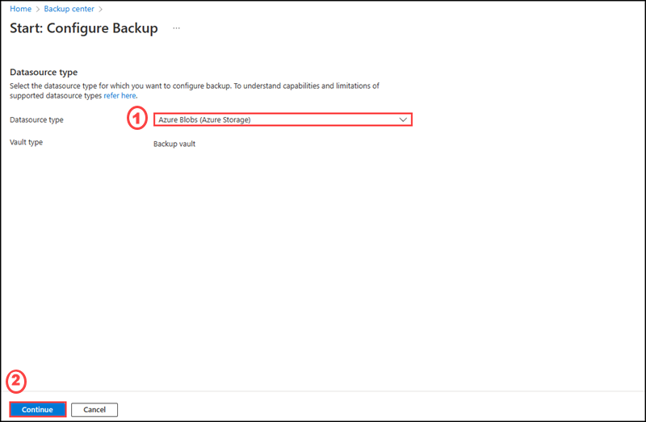

4. On the **Basics** tab, please select **Select vault** option.

    

5. Please select the Backup vault, and select **Select** button from the Select a Vault side screen.

    

6. On the Configure Backup page, please select **Create new** for Backup policy option under Backup policy tab.

    

7. On the Create Backup policy page, under Basics tab, please provide **Policy name** as **backvaultp1** (you can provide any name) and select **Review+Create** button.

    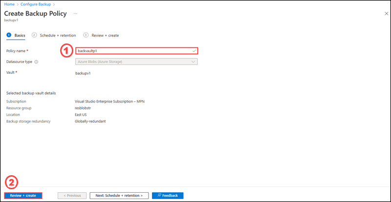

8. Please review the content, under Review+create tab and select **Create** button.

    

9. Once creates the backup policy, it will automatically selected on the backup policy option on Configure backup page under Backup policy tab.

    

10. On **Configure Backup** page, under **Datasources** tab, please select **+Add/Edit** option.

    

11. Under Select resources to backup side screen, please select the storage account which you created in Task 1 and then select Select(1 item) button.

    

12. Backup verifies that the vault has sufficient permissions to allow backup configuration on the selected storage accounts. Validations take time to complete. Following validation, the Backup readiness column will indicate whether the Backup vault has sufficient permissions to configure backups for each storage account.
Here, you can see the success status under Backup readiness tab, please select Next button.

    

13. After completing the review successfully, please select **Configure backup** button.

    

14. Please wait for completing the configuration process, then select **Vaults** option under **Manage** pane on the Backup center page, you can see the backup vault successfully configured.

    
    
#### Review

In this lab, you have:

- Configured storage account to use a customer-managed key stored in a Key Vault
- Configured a Shared Access Signature 
- Enabled Backup Soft Delete
- Configured a Backup vault
- Configured the Storage account backup contributor role 
- Configured Backup
