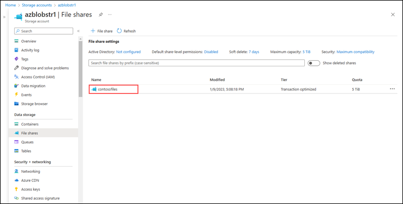
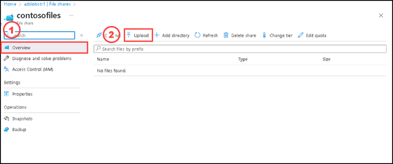
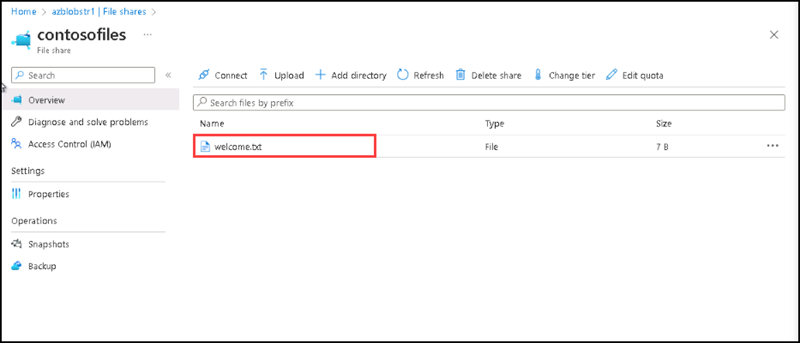
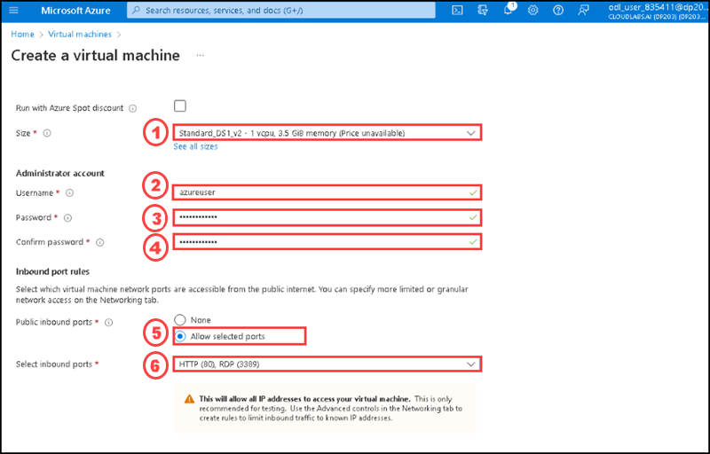
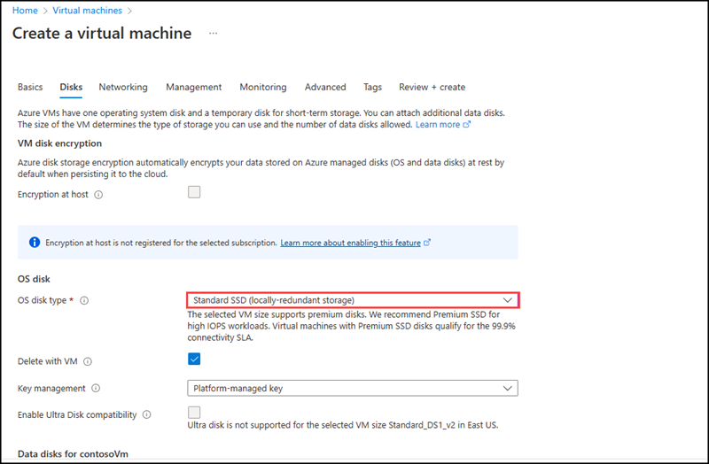
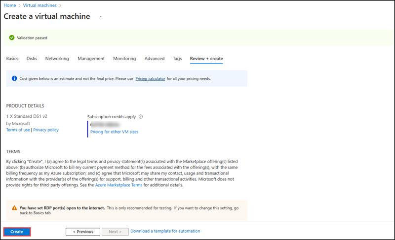
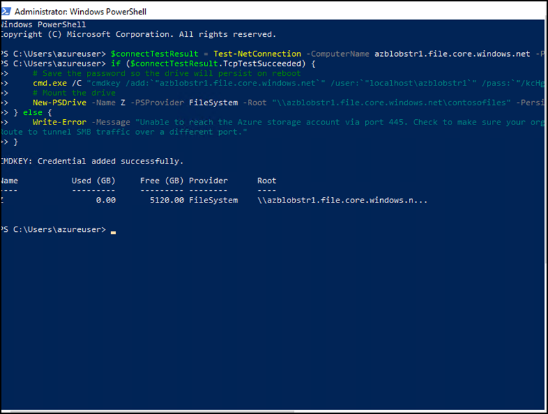

## Instructions

## Exercise 3: Setup Azure File and access from a Virtual machine

In this exercise, you will learn how to use the Azure portal to set up a file share and accessing it from a virtual machine.

In this Exercise, you will have:

+ Task 1: Setup Azure File and access from a Virtual machine

## Estimated timing: 60 minutes

### Task 1: Setup Azure File and access from a Virtual machine

Azure Files provides fully managed cloud file shares that can be accessed via the industry standard Server Message Block (SMB) or Network File System (NFS) protocols.
In this task, you are going to configure a file share and configure a virtual machine to access the file share.

#### Pre-requisites for this task

An Azure account, a storage account (Complete Task 1). The following steps outline only one of many possible, viable approaches.

#### Steps

1. To select the storage account go to **All services** and select **Storage accounts**.

    

2. From the list of storage accounts select the storage account which you have created on the previous task.

    

2. Select the **File shares** under data storage pane and select **+ File share** option.

    

3. On the **New file share** side screen enter the name as **contosofiles**, then the tier keep as **Transaction optimized** and select **Create** button.

    

4. Create a new text file called welcome.txt (any name you can choose) on your local machine by opening notepad.

5. Select the newly created file share.

    

6. On the **Overview** section, select **Upload** option.

    

7. On the Upload files side screen, please select **browse** button and then select the text file which you created on the previous step and select upload.

    

8. You can see the uploaded file in the azure file share, if its not visible please click on refresh button on the top menu.

    

9. You've already created an Azure storage account and a file share with one file. Next, to represent the on-premises server, create an Azure Virtual machine with Windows Server 2019 Datacenter. In azure portal on the search bar please enter virtual machines and select virtual machines from the options listed.

    

10. On the Virtual machines page, please select **Create**.

    

11. On the Create a Virtual machine page under **Basics** tab, please enter the following details:

    | Settings | Values |
    |  -- | -- |
    | Subscription | **Use default supplied** |
    | Resource group | **Select the resource group name** |
    | Virtual machine name | **contosoVm** |
    | Region | **(US) East US**|
    | Availability options | **No infrastructure redundancy options required** |
    | Image | **Windows Server 2019 Datacenter - Gen2** |
    | VM Architecture | **X64** |

    

12. Please enter the following details under Basics tab:  
    
    | Settings | Values |
    |  -- | -- |
    | Size | **Standard_DS1_v2 - 1 vcpu, 3.5 GiB memory** |
    | Administrator account username | **azureuser** |
    | Administrator account password (type in carefully!) | **Pa$$w0rd123!**|
    | Inbound port rules - | **Allow select ports **|
    | Select inbound ports | **RDP (3389)** and **HTTP (80)**| 

    

13. After entering all the details on Basics tab please switch to **Disks** tab and enter the details as per the below image:

    

14. Switch to the **Networking** tab to ensure **RDP (3389)** is selected in section **Select inbound ports**.

15. Switch to the **Monitoring** tab and Select **Disable option for Boot diagnostics** under **Diagnostics section**.

    
 
16. Leave the remaining values on the defaults and then click the **Review + create** button at the bottom of the page.

17. After successfully completed the validation, please select **Create**.

    

18.Once the deployment completed, please select **Go to resources**.

    

19. On the ContosoVm virtual machine page, at the overview section, please select Connect.

    

20. On the **Connect to virtual machine** page, keep the default options to connect with the public IP address over port 3389 and click **Download RDP File**. A file will download on the bottom left of your screen.

    

21. **Open** the downloaded RDP file (located on the bottom left of your lab machine) and click **Connect** when prompted. 

    

22. On the **Windows Security** window, sign in using the Admin Credentials you used when creating your Virtual machine **azureuser** and the password **Pa$$w0rd123!**. 

    

23. You may receive a warning certificate during the sign-in process. Click **Yes** or to create the connection and connect to your deployed Virtual machine. You should connect successfully.

    

A new Virtual Machine (contosoVm) will launch inside your Lab. Close the Server Manager and dashboard windows that pop up (click "x" at top right). You should see the blue background of your virtual machine. **Congratulations!** You have deployed and connected to a Virtual Machine running Windows Server. Please dont close the virtual machine window.

24. In the Azure portal, navigate to the storage account which you created on the previous task and select fileshares and select **contosofiles**.

    

25. On the overview section, please select **Connect.**

    

26. Select a drive letter then click on show script, then copy the contents of the show script and paste it in a Notepad.

    

27. In the Virtual machine, open PowerShell and paste in the contents of the Notepad, then press enter to run the command. It should map the drive. You have successfully mapped the drive.

    

28. Open the **File explorer** in the virtual machine and double click on **contosofiles**, you can see the text file created on fileshares named **contosofiles** in azure portal.

### Clean up resources

   >**Note: Remember to remove any newly created Azure resources that you no longer use. Removing unused resources ensures you will not see unexpected charges, although keep in mind that Azure policies do not incur extra cost.**
   
   >**Note:  Don't worry if the lab resources cannot be immediately removed. Sometimes resources have dependencies and take a longer time to delete. It is a common Administrator task to monitor resource usage, so just periodically review your resources in the Portal to see how the cleanup is going.** 

   >**When you're done, delete the resource group. Deleting the resource group deletes the storage account, the Azure file share, virtual machine and any other resources that you deployed inside the resource group.**

1. Select Home and then Resource groups.

2. Select the resource group you want to delete.

3. If the lock is restricted to delete the resource group, please go to the Locks under settings tab of the resource group and select delete.

3. Select Delete resource group. A window opens and displays a warning about the resources that will be deleted with the resource group.

4. Enter the name of the resource group, and then select Delete.
    
#### Review

In this lab, you have:

- Setup an Azure File and access from a Virtual machine.
