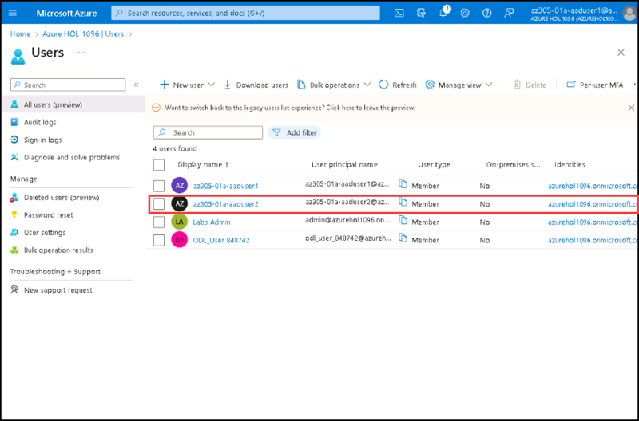
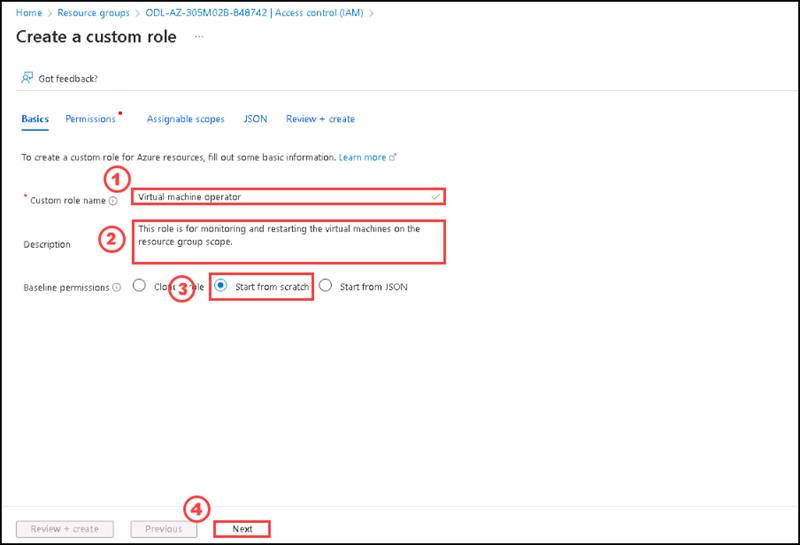
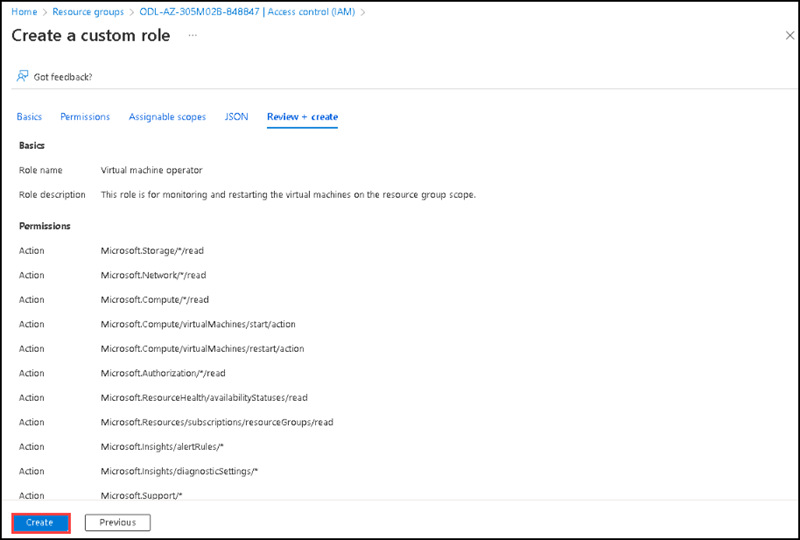
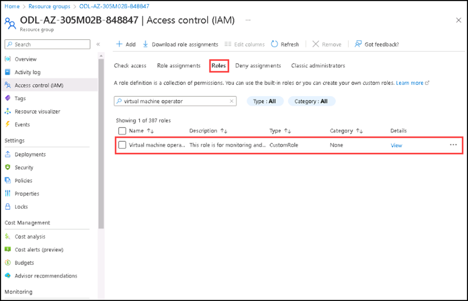

## Exercise 2: Assign Active Directory Role & Custom RBAC.

In order to allow Contoso users to authenticate by using Azure AD, you have been tasked to provide Azure Active Directory roles and custom RBAC roles to the new users.

In this lab, you will:

+ Task 1: Add Azure Active Directory roles to the new users.
+ Task 2: Add Custom RBAC roles.

### Estimated Timing: 30 minutes

### Task 1: Add Azure Active Directory roles to the new users

In this task you are going to add Azure Active directory roles to the new users created on exercise 1.

#### Pre-requisites for this task

Complete Exercise 1.

#### Steps:

1. Go to **Active directory**, select **Users**, then select **az305-01a-aaduser1** user

2. In the **Manage** section, click **Assigned roles**, then click **+ Add assignment** button.

    

3. On the **Directory roles** side screen, please search for **User Administrator** role and select the role, then select **Add**.

    

4. Keep refresh **Assigned roles** page, you can see the **User Administrator** role added successfully.

    

5. Open an **InPrivate** browser window and sign in to the [Azure portal](https://portal.azure.com) using the newly created user account. When prompted to update the password, change the password to a secure password of your choosing. 

    >**Note**: Rather than typing the username (including the domain name), you can paste the content of Clipboard.

6. In the **InPrivate** browser window, in the Azure portal, search for and select **Azure Active Directory**.

    >**Note**: While this user account can access the Azure Active Directory tenant, it does not have any access to Azure resources. This is expected since such access would need to be granted explicitly by using Azure Role-Based Access Control. 

7. In the **InPrivate** browser window, on the Azure AD blade, in the **Manage** section, click **Users**, and then click **+ New user**.

    

8. Create a new user with the following settings (leave others with their defaults):

    | Setting | Value |
    | --- | --- |
    | Username  | **az305-01a-aaduser2** |
    | Name | **az305-01a-aaduser2** |
    | Let me create the password | enabled |
    | Initial password | **Provide a secure password** |
    | Usage location | **United States** |
    | Job title | **System Administrator** |
    | Department | **IT** |

9. You have successfully created the new user.

    

10. Sign out as the az305-01a-aaduser1 user from the Azure portal and close the InPrivate browser window.

### Task 3: Add Custom RBAC roles

Create a custom role in Azure Role-Based Access Control (RBAC) if none of the built-in roles meet your specific access needs. Custom roles can be created using Azure PowerShell, Azure Command-Line Interface (CLI), and the REST API. Just like built-in roles, custom roles can be assigned to users, groups, and applications at subscription, resource group, and resource scopes.

#### Pre-requisites for this task

Complete Exercise 1 & Exercise 2 - Task 1.

#### Steps:

1. Go to the **ODL-AZ-305-M02B-XXXXXXX** resource group.

2. On the resource group page, please select **Access control (IAM)**, then select **+Add**, then select **Add custom role**.

    

3. On the **Create a custom role** page, under **Basics** tab, please enter the following details and then select **Next** at the bottom.

   | Section | Values |
   | ------- | ------ |
   | Name | **Virtual machine operator** |
   | Description | **This role is for monitoring and restarting the virtual machines on the resource group scope.** |
   | Baseline permissions | Select **Start from scratch** |
   
      

4. Go to **JSON** tab and click on **Edit**.

      

5. Please enter the following JSON script inside the **action** section, then click **Save**.

   ```JSON
         "Microsoft.Storage/*/read",
          "Microsoft.Network/*/read",
          "Microsoft.Compute/*/read",
          "Microsoft.Compute/virtualMachines/start/action",
          "Microsoft.Compute/virtualMachines/restart/action",
          "Microsoft.Authorization/*/read",
          "Microsoft.ResourceHealth/availabilityStatuses/read",
          "Microsoft.Resources/subscriptions/resourceGroups/read",
          "Microsoft.Insights/alertRules/*",
          "Microsoft.Insights/diagnosticSettings/*",
          "Microsoft.Support/*"
   ```
   
       
   
6. Please select **Review + assign**, then click **Create**.

     

7. You will get a message saying that **You have successfully created the custom role Virtual machine operator.** please click **OK** to that message.

8. On the **Role** tab please search **virtual machine operator**, you can see the custom role listed.

    

9. Select **+Add**, then select **Add role assignment**. You are going to assign the custom role to the user **az305-01a-aaduser1**.

10. In the **Add role assignment** page, on the **Role** tab, please select **Virtual machine operator** by searching on the search bar.

    

11. on the **Members** tab, please select **+Select members**.

12. On the **Select members** side screen please select **az305-01a-aaduser1** user and select **Select**.

    

13. Please select **Review + Assign** at the bottom, review the role assignment settings

14. Click **Review + assign** to assign the role.

15. Take an **In private window** for Azure portal and login with the user **az305-01a-aaduser1**, then go to the resource group **ODL-AZ-305-M02B-XXXXXXX** and select the virtual machine from the overview section. You can see the option to connect and restart the virtual machines are enabled.

    
    
### Clean up resources

>**Note : Please do not delete resources you deployed in this lab. You will reference them in the next lab of this module.**

#### Review

In this lab, you have:

- Assigned Azure AD roles and tested it.
- Created custom RBAC roles and assigned it to the user.    
