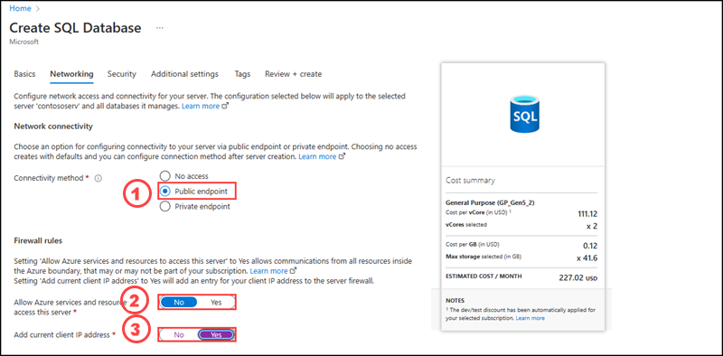
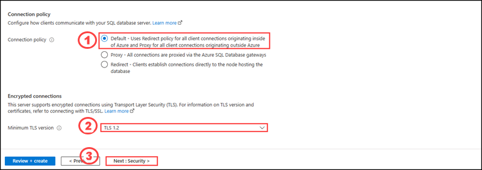
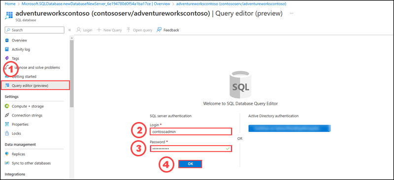
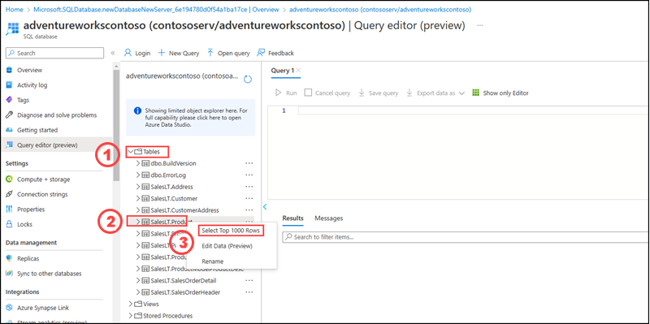
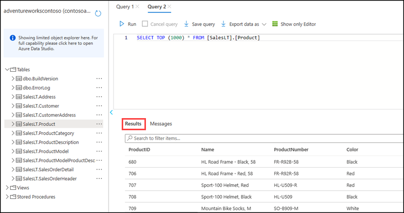

## Instructions

## Exercise 1: Configure and deploy a relational data storage solution 

### Task 1: Create a single database with Adventure Works pre-loaded

In this task, you will learn how to use Azur portal to create a single database with Adventure works sample database

#### Pre-requisites for this task

An Azure account, a resource group

#### Steps

1. Login into Azure portal and on the search box type SQL database, then please select the SQL database option from the list.

2. Please select the + Create button.

3. Under Basic tab, please enter the following details:

    | Settings | Values |
    |  -- | -- |
    | Subscription | **Use default supplied** |
    | Resource group | **Select the resource group name created on the previous exercise** |
    | Database name | **adventureworkscontoso** |
   
 

4. For server, click Create new.

 

5. On Create SQL Database Server page, please enter the following details:

    | Settings | Values |
    |  -- | -- |      
    | Server name | **contososerv** |
    | Location | **East US** |
    | Authentication method | **Use SQL authentication** |
    | Server admin login | **contosoadmin** 
    | Password |  **Contoso@123** 
    | Confirm password | **Contoso@123** |    
    
     

6. After creating the database server, please enter the following 

    | Settings | Values |
    |  -- | -- |      
    | Server name | **contososerv** |
    | Want to use SQL elastic pool? | **No** |
    | Workload environment | **Production** |
    | Compute + storage | **General Purpose (Standard-series (Gen5), 2 vCores, 32 GB storage, zone redundant disabled)** |
    | Backup storage redundancy |  **Geo-redundant backup storage** |
    
 

7. On the Networking tab, for Connectivity method, select Public endpoint.

8. For Firewall rules, set Add current client IP address to Yes. Leave Allow Azure services and resources to access this server set to No. 

 

9. Under Connection policy, choose the Default connection policy, and leave the Minimum TLS version at the default of TLS 1.2.

 

10. Select Next: Security at the bottom of the page, then keep the default settings as it is.

11. Select Next: Additional settings at the bottom of the page.

12. On the Additional settings tab, in the Data source section, select Sample for Use existing data and click ok on the AdventureWorksLT dialogue box. Instead of an empty blank database, this creates an AdventureWorksLT sample database with tables and data to query and experiment with.

13. After selecting AdventureWorksLT sample database, please select Review + Create.

14. After validation completed successfully, please select create.

15. Once the deployment completed, please select Go to Resource.

16. On the adventureworkscontoso database page please select Query Editor, then enter the following details:

    | Settings | Values |
    |  -- | -- |      
    | Login | **contosoadmin** |
    | Password | **Contoso@123** |
    
  
 
 17. After opening the Query editor, please expand tables and right click on **SalesLT.Product** table, then select **Select Top 1000 rows**.

 
 
 18. After executing the query, you can see the T-SQL statement on the query pane and the list of products in the result pane.

 

