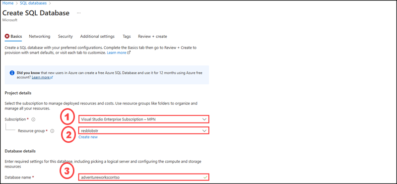

## Instructions

## Exercise 1: Configure and deploy a relational data storage solution 

### Task 1: Create a single database with Adventure Works pre-loaded

In this task, you will learn how to use Azur portal to create a single database with Adventure works sample database

#### Pre-requisites for this task

An Azure account, a resource group

#### Steps

1. Login into Azure portal and on the search box type SQL database, then please select the SQL database option from the list.

2. Please select the + Create button.

3. Under Basic tab, please enter the following details:

    | Settings | Values |
    |  -- | -- |
    | Subscription | **Use default supplied** |
    | Resource group | **Select the resource group name created on the previous exercise** |
    | Database name | **adventureworkscontoso** |
   
 

4. For server, click Create new.

 

5. On Create SQL Database Server page, please enter the following details:

    | Settings | Values |
    |  -- | -- |      
    | Server name | **contososerv** |
    | Location | **East US** |
    | Authentication method | **Use SQL authentication** |
    | Server admin login | **contosoadmin** 
    | Password |  **Contoso@123** 
    | Confirm password | **Contoso@123** |    
    
     

6. After creating the database server, please enter the following 

    | Settings | Values |
    |  -- | -- |      
    | Server name | **contososerv** |
    | Want to use SQL elastic pool? | **No** |
    | Workload environment | **Production** |
    | Compute + storage | **General Purpose** |
                        | **Standard-series (Gen5), 2 vCores, 32 GB storage, zone redundant disabled** |
    | Backup storage redundancy |  **Geo-redundant backup storage** |
    
 

7.   

