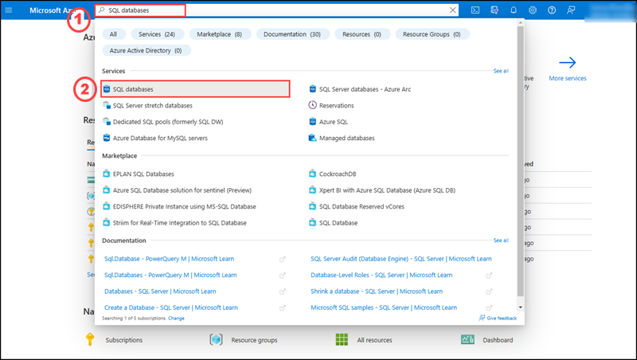
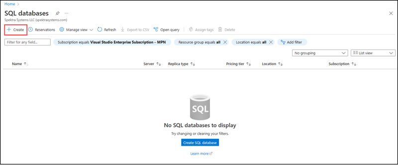
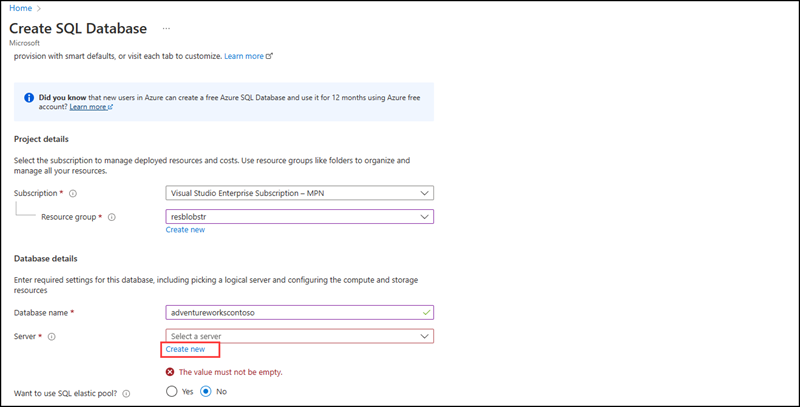
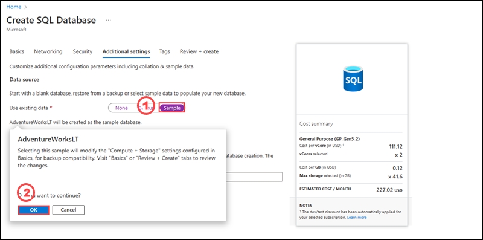
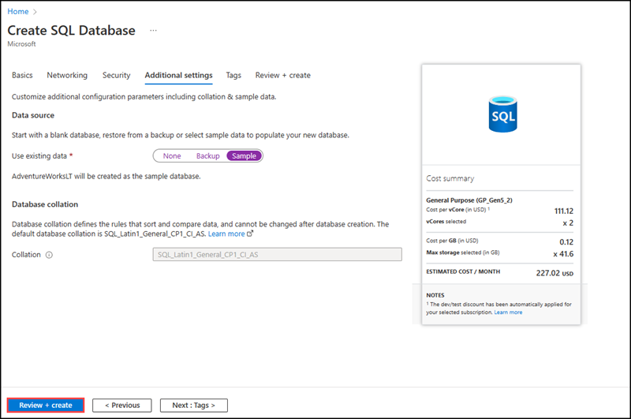

# Instructions

## Exercise 1: Configure and deploy a relational data storage solution 

In this exercise, you are going to deploy an Azure SQl database. 

In this exercise, you will:

+ Task 1: Create an Azure SQL database with Adventure Works pre-loaded.

### Estimated Timing: 60 minutes

### Task 1: Create an Azure SQL database with Adventure Works pre-loaded

In this task, you will learn how to use Azur portal to create a single database with Adventure works sample database

#### Pre-requisites for this task

An Azure account, a resource group

#### Steps

1. Login into Azure portal and on the search box type SQL database, then please select the **SQL database** option from the list.

    

2. Please select the **+ Create** button.

    

3. Under **Basic** tab, please enter the following details:

    | Settings | Values |
    |  -- | -- |
    | Subscription | **Use default supplied** |
    | Resource group | **Select the resource group name from the dropdown list** |
    | Database name | **adventureworkscontoso** |
   
     

4. For server, click **Create new**.

     

5. On **Create SQL Database Server** page, please enter the following details:

    | Settings | Values |
    |  -- | -- |      
    | Server name | **contososerv** |
    | Location | **East US** |
    | Authentication method | **Use SQL authentication** |
    | Server admin login | **contosoadmin** 
    | Password |  **Contoso@123** 
    | Confirm password | **Contoso@123** |    
    
         

6. After creating the database server, please enter the following 

    | Settings | Values |
    |  -- | -- |      
    | Server name | **contososerv** |
    | Want to use SQL elastic pool? | **No** |    |
    | Compute + storage | **General Purpose (Standard-series (Gen5), 2 vCores, 32 GB storage, zone redundant disabled)** |
    | Backup storage redundancy |  **Geo-redundant backup storage** |
    
     

7. On the **Networking** tab, review the default settings and go to **Security** tab.

8. Select **Next: Security** at the bottom of the page, then keep the default settings as it is.

9. Select **Next: Additional settings** at the bottom of the page.

10. On the **Additional settings** tab, in the **Data source** section, select **Sample** for Use existing data and click **Ok** on the **AdventureWorksLT** dialogue box. Instead of an empty blank database, this creates an AdventureWorksLT sample database with tables and data to query and experiment with.

    

11. After selecting AdventureWorksLT sample database, please select **Review + Create**.

    

12. After validation completed successfully, please select **Create**.

13. Once the deployment completed, please select **Go to Resource**.

### Clean up resources

>**Please do not delete resources you deployed in this lab. You will reference them in the next lab of this module.**

### Review

In this lab, you have:

+ Deployed an Azure SQL database.
