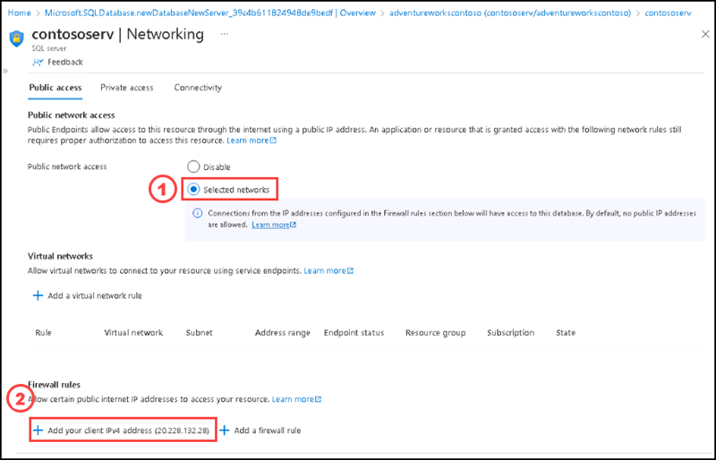

## Instructions

## Exercise 2: Enable Firewall rules and connect to DB.

In this Exercise, you will configure Server firewall and database firewall to Adventureworks database and connect it. 

### Task 1: Set up server-level firewall rules using Azure Portal

In this task you will copnfigure Server firewall. Azure SQL Server is protected by server-level firewall rules. As a result, it applies to all underlying Azure SQL Databases. Before reaching the Azure server or database, each connection must pass through the firewall.

#### Pre-requisites for this task

An Azure account, a resource group and an Azure SQL Database (Complete Exercie 1).

#### Steps:

1. Login into Azure portal.

2. Please select the database you have created on the previous exercise. Select **Set Server Firewall** on the **Overview** section.

3. On the Networkinmg page, Please select **Selected Networks**. To add your current IP address to a new server-level firewall rule, select **+ Add your client IP**. This rule has the ability to open Port 1433 for a single IP address or a range of IP addresses. 

**Note: You can also configure the firewall by selecting Add a firewall rule.**

4. Choose Save. Port 1433 is now open on the server, and a server-level IP-based firewall rule for your current IP address is created.

