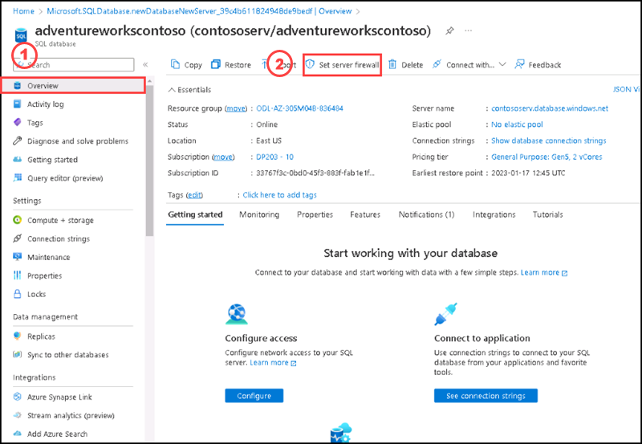
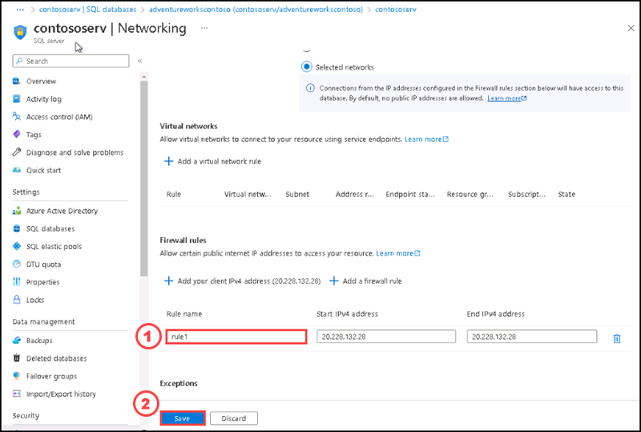
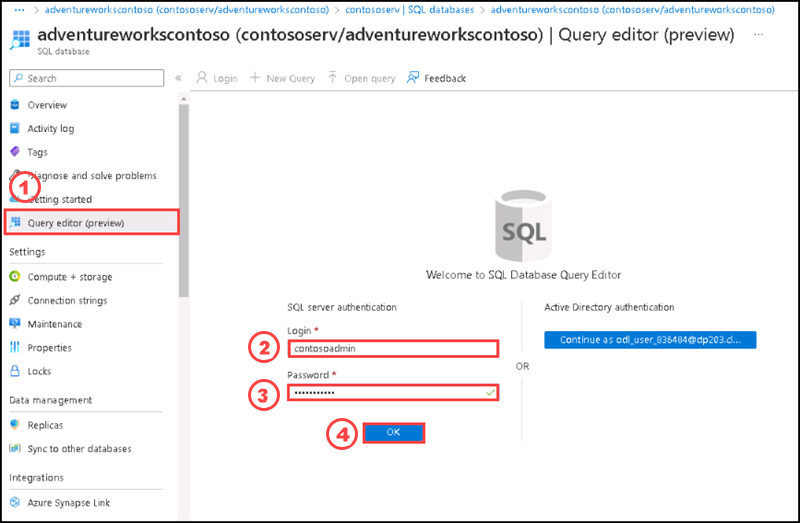
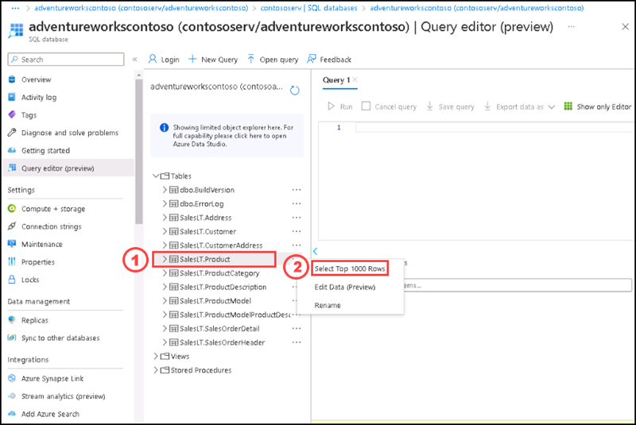
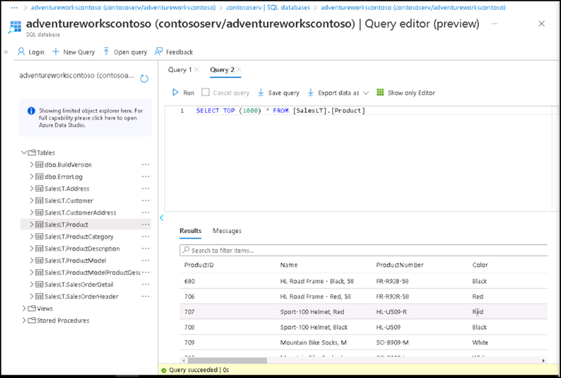
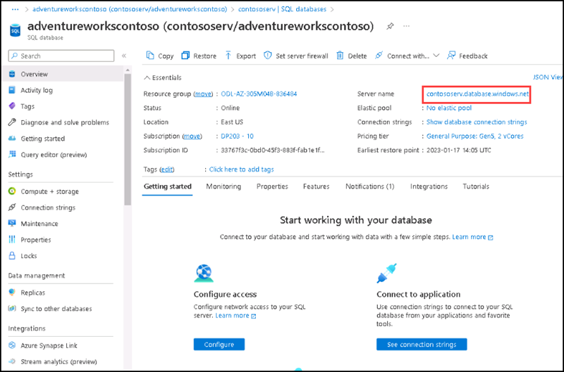
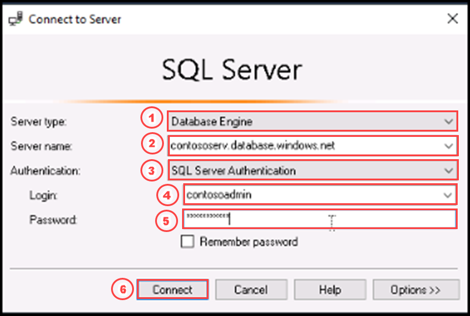
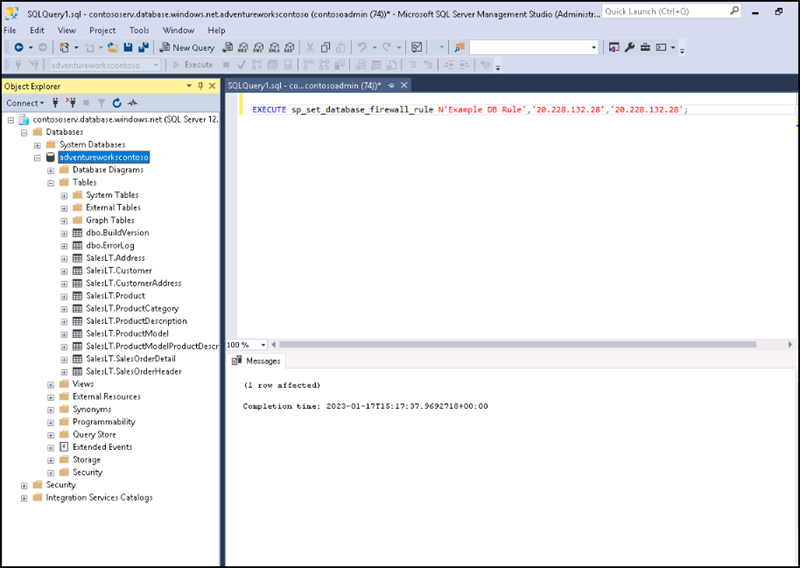

# Instructions

## Exercise 2: Enable Firewall rules and connect to Database.

When you create a new server in Azure SQL Database, a server-level firewall prevents all access to the server's public endpoint. To retrieve data, in this exercise, you will configure Server firewall and database firewall to Adventureworks database and connect it. 

In this exercise, you will:

+ Task 1: Set up server-level firewall rules using Azure Portal.
+ Task 2: Setup database firewall rules.

### Estimated Timing: 30 minutes

### Task 1: Set up server-level firewall rules using Azure Portal

In this task you will configure Server firewall. Azure SQL Server is protected by server-level firewall rules. As a result, it applies to all underlying Azure SQL Databases. Before reaching the Azure server or database, each connection must pass through the firewall.

#### Pre-requisites for this task

Complete Exercise 1.

#### Steps:

1. Login into Azure portal if you have logged out.

2. Please select the database named **adventureworkscontoso** you have created in previous exercise. Select **Set Server Firewall** on the **Overview** section.

    

3. On the Networking page, please select **Selected Networks**. To add your current IP address to a new server-level firewall rule, select **+ Add your client IP** as in below screenshot. This rule has the ability to open Port 1433 for a single IP address or a range of IP addresses. 

    

    >**Note** : **You can also configure the firewall by selecting Add a firewall rule.**

4. Change the **Rule name** as **rule1** and then click on **Save**. Port 1433 is now open on the server, and a server-level IP-based firewall rule for your current IP address is created.

    

5. Navigate back to **adventureworkscontoso** page and select **Query Editor**. Provide the login as **contosoadmin** and Password **Contoso@123** then click **Ok**.

    

6. Expand the **Tables**, then click on the elipsis **(...)** of the table named **SalesLT.Product** and select **Select Top 1000 rows**.

    

7. You can see the output data under **Results** for the table SalesLT.product.

    

### Task 2: Setup database firewall rules

Database-level firewall rules only apply to individual databases. The database will retain these rules during a server failover. Database-level firewall rules can only be configured using Transact-SQL (T-SQL) statements, and only after you've configured a server-level firewall rule. In this task you will configure a database firewall rule.

#### Pre-requisites for this task

Complete Exercise 1, Exercise 2 - Task 1.

#### Steps:

1. Click on the **Start** button of the LabVM and type **SSMS** and select **Microsoft SQL Server Management Studio**.

2. Go to the Azure portal, on the **adventureworkscontoso** database page, copy the **server name**.

    

3. Back to the SSMS window, on the **Connect to Server** pop-up window, please paste the server name copied from the azure portal on the server name property.

    | Settings | Values |
    |  -- | -- |
    | Server tpe | **Database Engine** |
    | Server name | **contososerv.database.windows.net** |
    | Authentication |  **SQL Server Authentication** |
    | Login | **contosoadmin** |
    | Password | **Contoso@123** |

    

4. In Object Explorer, right-click the database and select New Query.

5. In the query window, add the following statement and modify the IP address to your public IP address:

     ```T-SQL
      EXECUTE sp_set_database_firewall_rule N'Example DB Rule','20.228.132.28','20.228.132.28';
    ```  
 
 6. Click on **Execute** to run the query.   

     
 
 >**In case of any server failover, adventureworkscontoso database will retain the data.**


### Review

In this lab, you have:

+ Configured server-level firewall rules using Azure Portal.
+ Configured database firewall rules.
