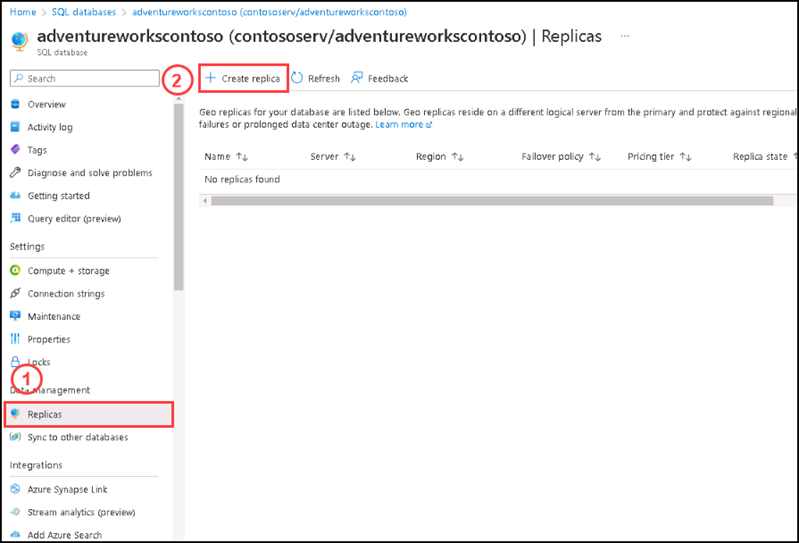
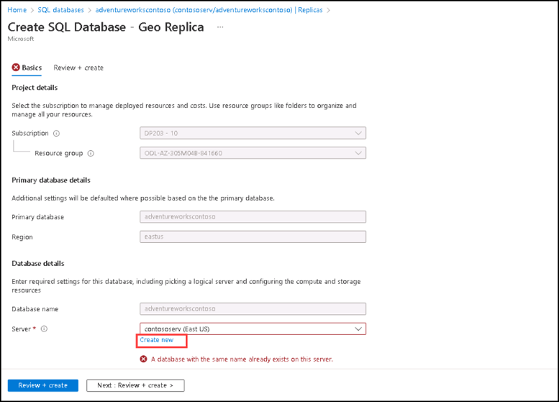
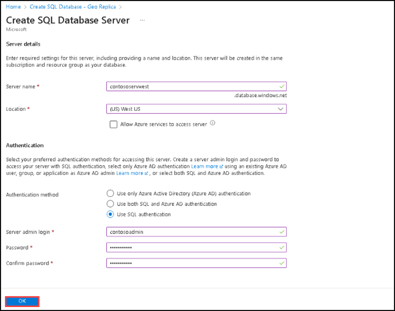
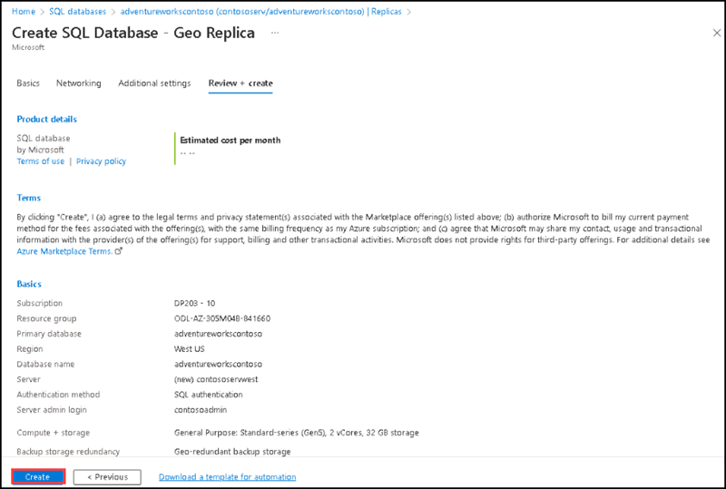
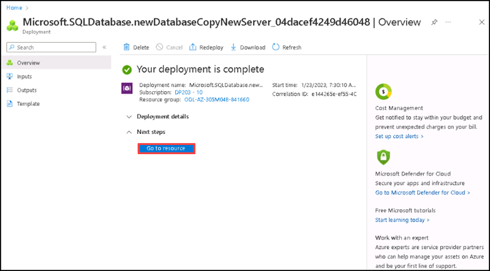
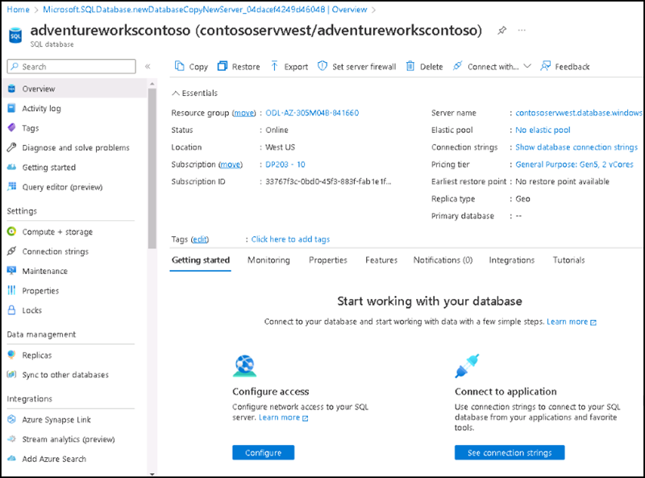
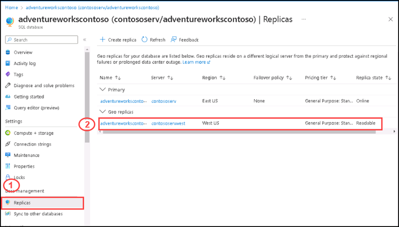
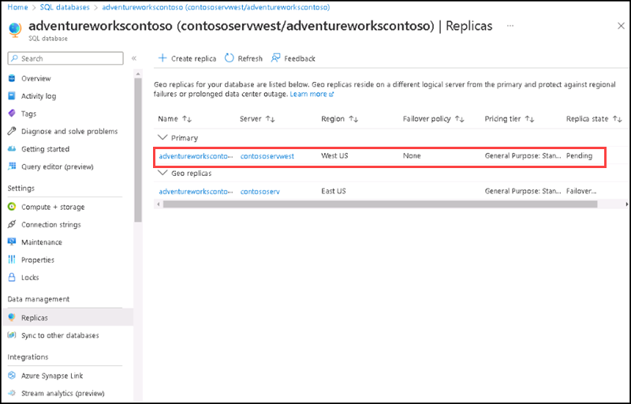
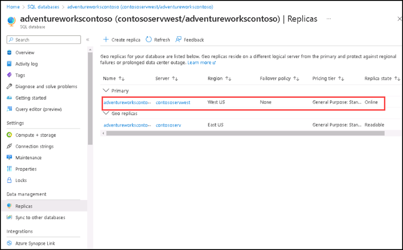

# Instructions

## Exercise 4: Enable Geo Replication & Test Failover.

In this Exercise you are going to configure active geo-replication for Azure SQL Database using the Azure portal and to initiate failover.

In this Exercise, you will have:

  + Task 1: Configure Replica of Primary database
  + Task 2: Initiate a failover

### Estimated Timing: 50 minutes

### Task 1: Configure Replica of Primary database

In this task you are going to configure a replica of your primary database.

#### Pre-requisites for this task

Complete Exercise 1 & Exercise 2 & Exercise 3.

#### Steps:

1. In the Azure portal, browse to the database that you have created on the previous exercise to set up for geo-replication.

2. On the SQL Database page, select your database, scroll to Data management section, select Replicas, and then select Create replica.

    
    
3. Create the secondary database server. You can choose any region for your secondary server, but the paired region is recommended. Please click on **Create new** for Server.

    
    
4. For creating new server, please enter the following details:

    | Settings | Values |
    |  -- | -- |      
    | Server name | **contososervwest** |
    | Location | **West US** (It is the paired region of East US) |
    | Authentication method | **Use SQL authentication** |
    | Server admin login | **contosoadmin** 
    | Password |  **Contoso@123** 
    | Confirm password | **Contoso@123** |    

    

5. After selecting the server, please go to **Compute + Storage** option to check whether it has the same database configuration of the primary database, if not please change the configuration by clicking on configure database and select the configuration of primary database (Here the primary database is  **adventureworkscontoso**). Please keep other options default values as it is.

6. Please Select **Review + Create**, then click **Create**.

    
    
7. You can see a notification of **Deployment in Progress**, please wait for a while, then you can see **Your deployment is complete** notification.

8. Please click on **Go to resource**.

    

9. You can see the replica of **adventureworkscontoso** database with new server named **contososervwest**.

    

10. Return to the **primary database** page, and then select **Replicas**. Your secondary database is listed under **Geo replicas**.

    

  Next you are going to initiate a failover thereby your secondary database becomes your primary database.    

### Task 2: Initiate a failover

In this task you are going to initiate a failover thereby your secondary database becomes your primary database.

#### Pre-requisites for this task

Complete Exercise 1 & Exercise 2 & Exercise 3 & Exercise 4- Task 1.

#### Steps:

1. Go to the Primary database in the azure portal.

2. Scroll to Data management, and then select Replicas.

3. In the Geo replicas list, select the secondary database you want to become the new primary, select the ellipsis **(...)** on the right side of the secondary database, and then select **Forced failover**.

    
 
 4. A dialogue box will appear asking for Forced failover will switch adventureworkscontoso database to the primary role. Please select **Yes** on the dialogue box.

    

5. You will get a notification saying **Request submitted for failover replication**.

6. Go to database named **adventureworkscontoso (contososervwest/adventureworkscontoso)** select **Replicas**, then you can see under **Primary** the name of the current database with server **contososervwest** having a **pending** status.

  

7. Please keep refresh the page and you can see the primary database status becomes **online**.

### Clean up resources

>**Please do not delete resources you deployed in this lab. You will reference them in the next lab of this module.**

### Review

In this lab, you have:

+ Configured a replica of your primary database via azure portal.
+ Initiated a failover thereby you have seen the secondary database became primary.
