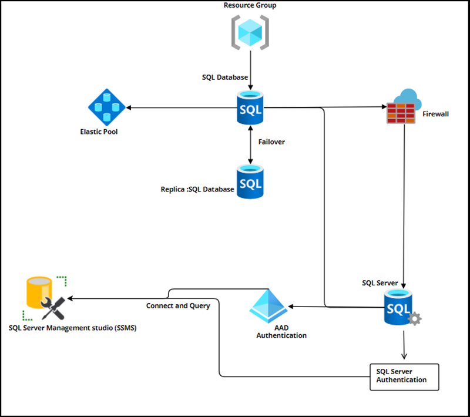

# Lab 04 - Configure and deploy a relational data storage solution ( Azure SQL Database solution) 

# Student lab manual

## Lab scenario

As a cloud architect at contoso organization, you have been tasked to create a sample AdvetureWorks database and configure firewalls and Azure Active directory to access the database server. Also configure the geo-replication and test the failover. After completing all these tasks you need to review the database cost and convert database into elastic pool. 

- Create a single database with Adventure Works pre-loaded. In Azure SQL Database, you can create a single database using the Azure portal, a PowerShell script, or an Azure CLI script. In this example we are usiong azure portal to create the database. The database is then queried using the Azure portal's Query editor.

- Enable Firewall rules and connect to DB. Azure SQL Databases have two types of firewalls:

Firewall at the server level : The server-level firewall rules apply to Azure SQL Server. As a result, it is applicable to all underlying Azure SQL Databases. Each connection must pass through the firewall before it can connect to an Azure server or database.

Firewall at the database level: The database firewall rules are specific to a specific Azure SQL Database. 

You are going to configure both server level and database level firewalls.

- Enable AAD authentication and query the DB. Azure Active Directory (Azure AD) authentication allows you to connect to your SQL resource using Azure AD identities. 
You can manage the identities of database users and other Microsoft services in one place with Azure AD authentication. Central ID management unifies database user management and simplifies permission management.

- Enable Geo Replication & Test Failover. You are going to configure an active Geo-replicationa and test the failover for Azure SQL database. So for that you will need the following resource to configure active geo-replication via the Azure portal:

A database in Azure SQL Database: The primary database that you want to replicate to a different geographical region.

- Review the DB Cost and Convert the DB into elastic pool. With an elastic pool, you determine the amount of resources that the elastic pool requires to handle the workload of its databases, and the amount of resources for each pooled database. So here you will review the cost of Adventureworks database and convert the adventureworks database into elastic pool.

## Objectives

In this lab, you will have:

+ Exercise 1: Create a single database with Adventure Works pre-loaded. 
+ Exercise 2: Enable Firewall rules and connect to AdventureWorks database..
+ Exercise 3: Enable Azure Active Directory authentication and query the Adventureworks database.
+ Exercise 4: Enable Geo Replication & Test Failover for Adventureworks database. 
+ Exercise 5: Review the Adventureworks database cost and convert the database into elastic pool.

## Estimated timing: 200 minutes

## Architecture diagram

