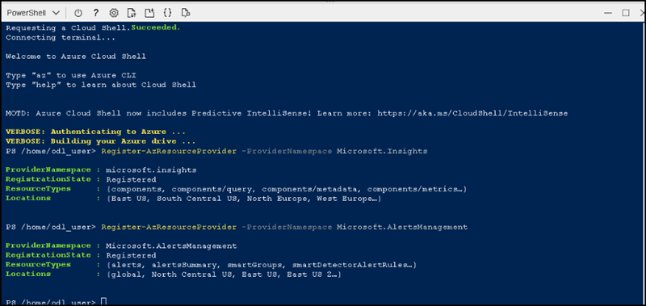
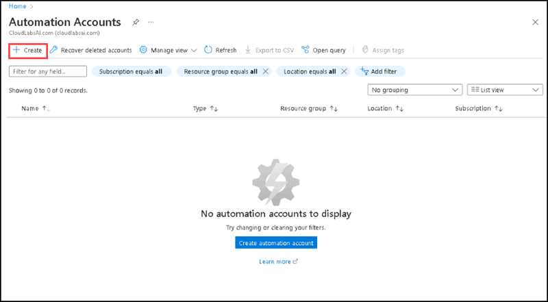
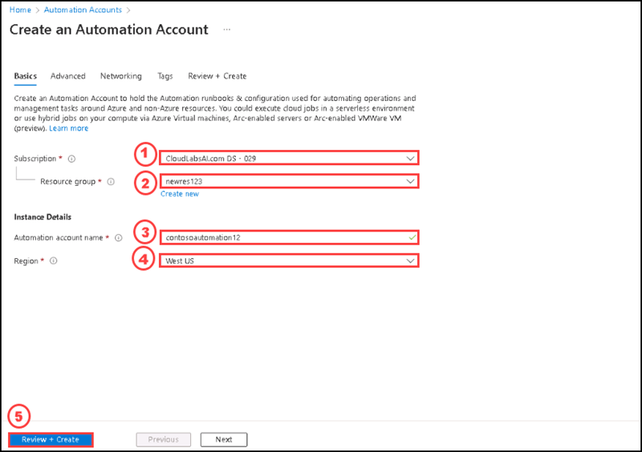
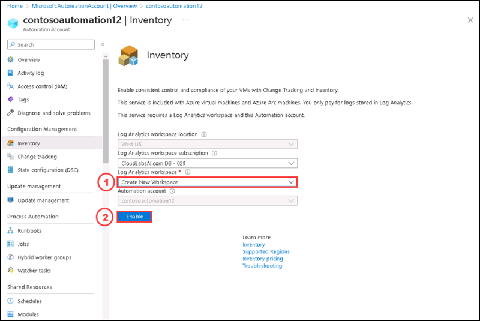
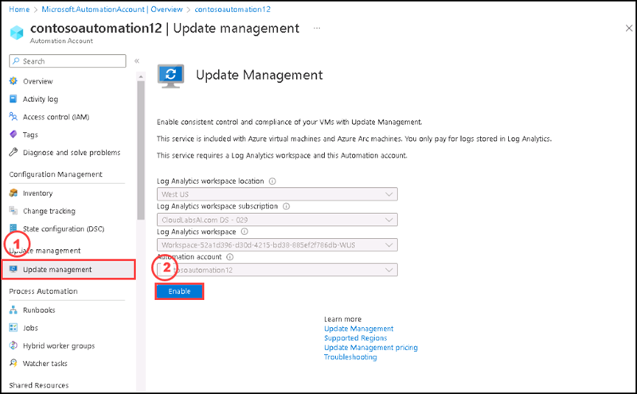
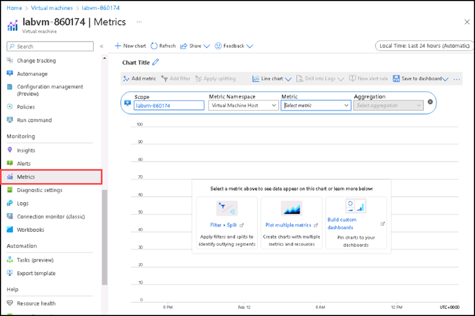
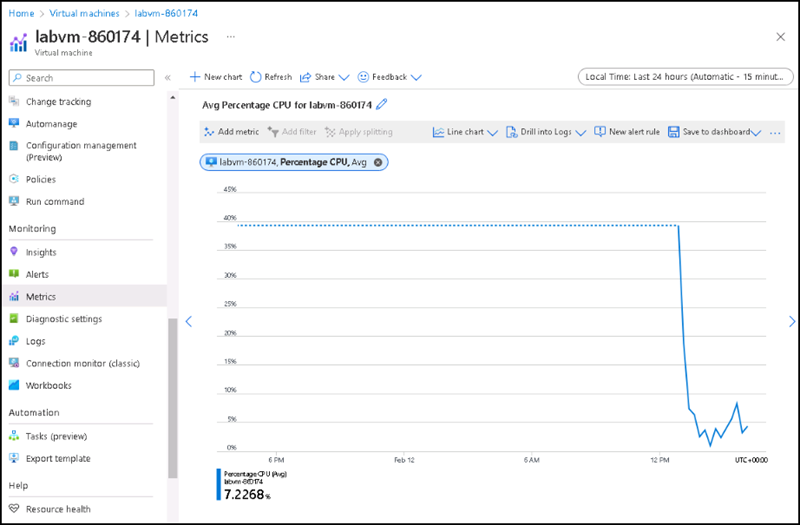
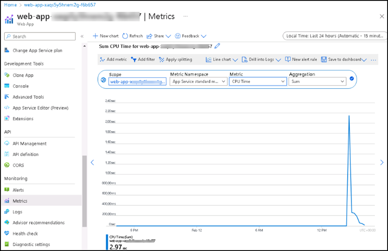
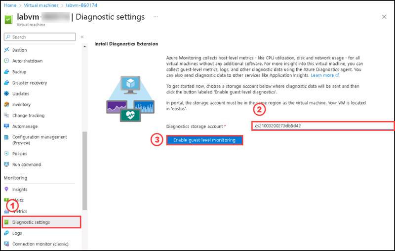

# Instructions

## Exercise 3: Monitor and assess the solutions and data in the Azure cloud platform


In this exercise, you will:

+ Task 1: Register the Microsoft.Insights and Microsoft.AlertsManagement resource providers
+ Task 2: Create and configure an Azure Automation-based solutions
+ Task 3: Review default monitoring settings of Azure Resources
+ Task 4: Collect and View Azure resource logs.
### Estimated Timing: 60 minutes

### Task 1: Deploy a quickstart template on Azure.

In this task, you will learn how to use Azur portal to deploy a template by using Deploy a custom template.

#### Pre-requisites for this task

An Azure account

#### Steps

1. Select **Cloud shell** and on the cloud shell pane please select **Powershell** and then select  **Create storage**.

2. From the Cloud Shell pane, run the following to register the **Microsoft.Insights** and **Microsoft.AlertsManagement** resource providers.

   ```powershell
   Register-AzResourceProvider -ProviderNamespace Microsoft.Insights

   Register-AzResourceProvider -ProviderNamespace Microsoft.AlertsManagement
   ```


You have successfully registered Microsoft.Insights and Microsoft.AlertsManagement resource providers

### Task 2: Create and configure an Azure Automation-based solutions

In this task, you will create and configure an Azure Log Analytics workspace and Azure Automation-based solutions


#### Steps:

1. In the Azure portal, search for and select **Automation Accounts**, and on the **Automation Accounts** blade, click **+ Create**.



2. On the **Create an Automation Account** blade, specify the following settings, and click **Review + Create** upon validation click **Create**:

    | Settings | Value |
    | --- | --- |
    | Subscription | the name of the Azure subscription you are using in this lab |
    | Resource group | **newres1** |
    | Automation account name | **contosoautomation1** |
    | Region | the name of the Azure region determined based on [Workspace mappings documentation](https://docs.microsoft.com/en-us/azure/automation/how-to/region-mappings) |

   

   
    >**Note**: Wait for the deployment to complete. The deployment might take about 3 minutes.

5. Click **Go to resource**.

6. On the Automation account blade, in the **Configuration Management** section, click **Inventory**.

7. In the **Inventory** pane, in the **Log Analytics workspace** drop-down list, select **Create new workspace** and select **Enable**.

   
   
   >**Note**: Wait for the installation of the corresponding Log Analytics solution to complete. This might take about 3 minutes.

    >**Note**: This automatically installs the **Change tracking** solution as well.

8. On the Automation account blade, in the **Update Management** section, click **Update management** and click **Enable**.



    >**Note**: Wait for the installation to complete. This might take about 5 minutes.

After this you are going to review the default monitoring settings of azure resources.

### Task 3: Review default monitoring settings of Azure Resources

In this task, you will review default monitoring settings of Azure virtual machines

#### Steps:

1. In the Azure portal, search for and select **Virtual machines**, and on the **Virtual machines** page, select **labvm-XXXXX**.

2. On the **labvm-XXXXX** page, in the **Monitoring** section, click **Metrics**.

3. On the **labvm-XXXXX| Metrics** page, on the default chart, note that the only available **Metrics Namespace** is **Virtual Machine Host**.

 

>**Note**: This is expected, since no guest-level diagnostic settings have been configured yet. You do have, however, the option of enabling guest memory metrics directly from the **Metrics Namespace** drop down-list. You will enable it later in this exercise.

4. In the **Metric** drop-down list, review the list of available metrics.

    >**Note**: The list includes a range of CPU, disk, and network-related metrics that can be collected from the virtual machine host, without having access into guest-level metrics.

5. In the **Metric** drop-down list, select **Percentage CPU**, in the **Aggregation** drop-down list, select **Avg**, and review the resulting chart.



6. Go to **App services**, select **web-app-XXXXX-XXXXXX** app service, Select **Metrics**. 

7. In the **Metric** drop-down list, select **CPU Time**, in the **Aggregation** drop-down list, select **Sum**, and review the resulting chart.



### Task 4: Collect and View Azure resource logs

#### Steps:

In this task, you will configure Azure virtual machine diagnostic settings.

1. On the **labvm-XXXXX** page, in the **Monitoring** section, select **Diagnostic settings**.

2. On the **Overview** tab of the **labvm-XXXXX| Diagnostic settings** page, select a **Diagnostic storage account**, and then click **Enable guest-level monitoring**.



    >**Note**: Wait for the diagnostic settings extension to be installed. This might take about 3 minutes.

3. Switch to the **Performance counters** tab of the **labvm-XXXXX| Diagnostic settings** page and review the available counters.


    >**Note**: By default, CPU, memory, disk, and network counters are enabled. You can switch to the **Custom** view for more detailed listing.

4. On the **labvm-XXXXX** page, in the **Monitoring** section, click **Logs** and then click **Enable**.


5. On the **Monitoring configuration** side screen, ensure **Azure Monitor agent (Recommended)** is selected, and then click **Configure**.  

   

    >**Note**: Do not wait for the operation to be completed, but instead proceed to the next step. The operation might take about 5 minutes.

6. On the **labvm-XXXXX| Logs** page, in the **Monitoring** section, click **Metrics**.

7. On the **labvm-XXXXX| Metrics** page, on the default chart, note that at this point, the **Metrics Namespace** drop-down list, in addition to the **Virtual Machine Host** entry includes also the **Guest (classic)** entry.

   

    >**Note**: This is expected, since you enabled guest-level diagnostic settings. You also have the option to **Enable new guest memory metrics**.

8. In the **Metrics Namespace** drop-down list, select  the **Guest (classic)** entry.

9. In the **Metric** drop-down list, review the list of available metrics.

    >**Note**: The list includes additional guest-level metrics not available when relying on the host-level monitoring only.

10. In the **Metric** drop-down list, select **Memory\\Available Bytes**, in the **Aggregation** drop-down list, select **Max**, and review the resulting chart.

#### Clean up resources

>**Note**: Remember to remove any newly created Azure resources that you no longer use. Removing unused resources ensures you will not see unexpected charges.

>**Note**:  Don't worry if the lab resources cannot be immediately removed. Sometimes resources have dependencies and take a longer time to delete. It is a common Administrator task to monitor resource usage, so just periodically review your resources in the Portal to see how the cleanup is going. 

1. Go to Resource groups, select **newres123**, then select **Delete**.

#### Review

In this lab, you have:

+ Registered the Microsoft.Insights and Microsoft.AlertsManagement resource providers
+ Created and configured an Azure Automation-based solutions
+ Reviewed default monitoring settings of Azure resources
+ Collected and Viewed Azure resource logs


