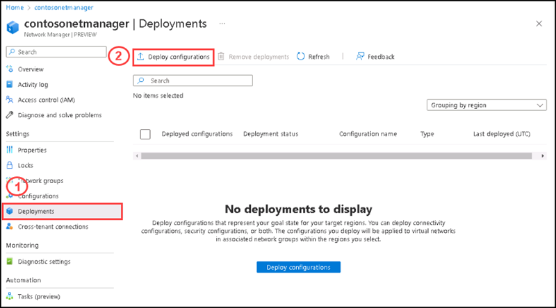

# Instructions

## Exercise 4: Create a hub and spoke connectivity configuration and Deploy the connectivity configuration

In this exercise, you are going to implement a hub-spoke network pattern where the hub virtual network acts as a central point of connectivity to many spoke virtual networks. The spoke virtual networks connect with the hub and can be used to isolate workloads.
In this exercise, you will:

  + Task 1: Create a hub and spoke connectivity configuration
  + Task 2: Deploy the connectivity configuration

### Estimated Timing: 60 minutes

### Task 1: Create a hub and spoke connectivity configuration

Before deploying the connectivity configuration, ensure that the virtual network gateway has been successfully deployed. The deployment will fail if you deploy a hub and spoke configuration with **Use the hub as a gateway enabled and there is no gateway**.

#### Steps:

1. Go to Network manager named **contosonetmanager**, select **Configuration** under Settings. Select **+ Create** and clcik on **Connectivity configuration** from the drop-down menu.

    

2. On the **Basics** tab, enter and select the following information for the connectivity configuration:

    | Section | Values |
    | ------- | ------ |
    | Name| Enter **HubA** for the name of the configuration |
    | Description | **This configuration contains a hub virtual network in the West US region**. |
  
    

3. Select **Next: Topology >**. On Topology, Select **Hub and spoke** option, then click on **Select a hub** under Hub setting. 

    

4. Select **Contoso-Vnet-WestUS** to serve as your network hub and click on **Select**.

    

5. Under **Spoke network groups**, select **+ Add** then **Add network groups**. Select **contosonetworkgrp** for the network group and click on **Select**.

    

6. After you've added the network group, select the following options:

    | Section | Values |
    | ------- | ------ |
    | Direct Connectivity| Select the checkbox for **Enable connectivity within network group**. This setting will allow spoke virtual networks in the network group in the same region to communicate with each other directly. |
    | Hub as gateway | Select the checkbox for Use **Hub as a gateway** |
  
    >**Note:** Leave the **Global Mesh** unchecked. This setting isn't required as both spokes are in the same region.
 
    
 
 7. Select **Next: Review + create** > and then create the connectivity configuration.
  
You have Created a hub and spoke connectivity configuration, now you are going to deploy the connectivity configuration.

### Task 2: Deploy the connectivity configuration

Before deploying the connectivity configuration, ensure that the virtual network gateway has been successfully deployed. The deployment will fail if you deploy a hub and spoke configuration with Use the hub as a gateway enabled and there is no gateway. In this task, you are going to deploy the connectivity configuration.

#### Steps:

1. On the **contosonetmanager** page, please select **Deployments**, then select **Deploy configuration**.

    

2. On the **Deploy a configuration** page, select **Include connectivity configurations** (If its already selected please leave in that state) in your goal state and **HubA** as the Connectivity configurations setting. Select **West US** and **East US** as the target regions and click on **Next**.

    

3. Select **Deploy**. You should now see the deployment show up in the list for those regions. The deployment of the configuration can take several minutes to complete.

    

You have successfully deployed the hub and spoke network configuration.

### Review

In this lab, you have:

+ Created a hub and spoke connectivity configuration.
+ Deployed the connectivity configuration.
