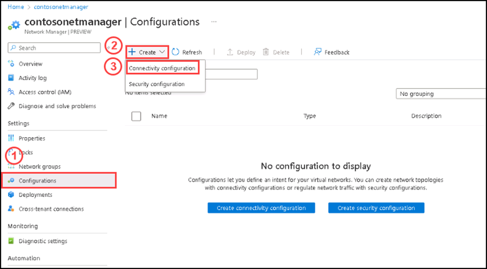
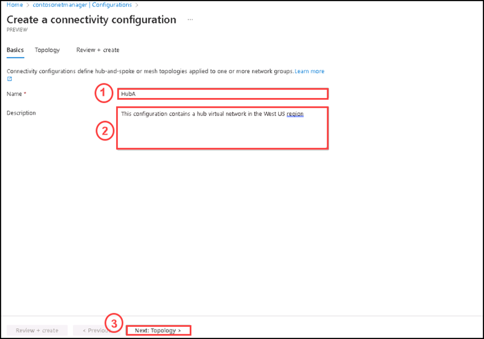
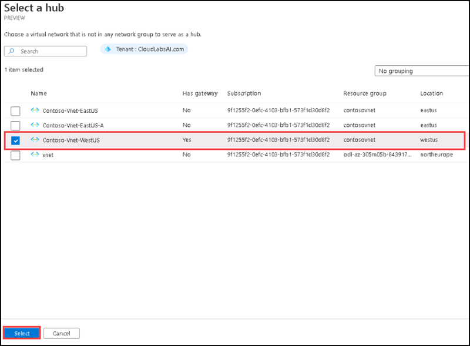
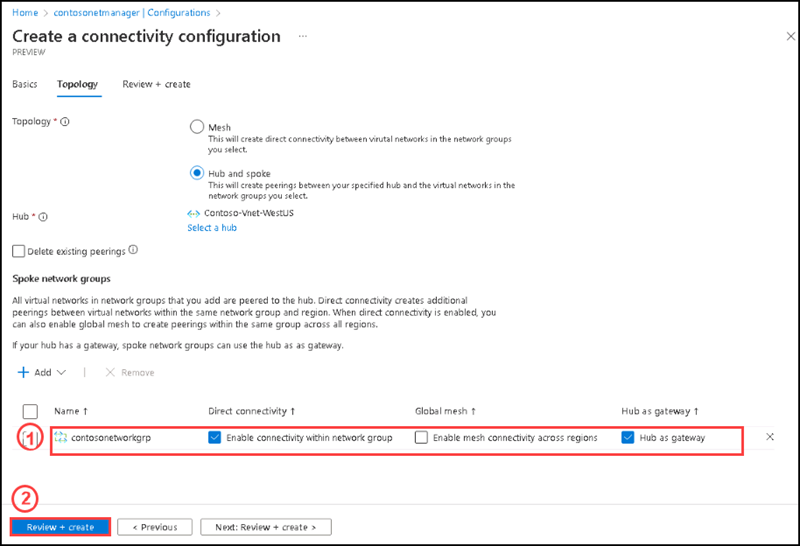
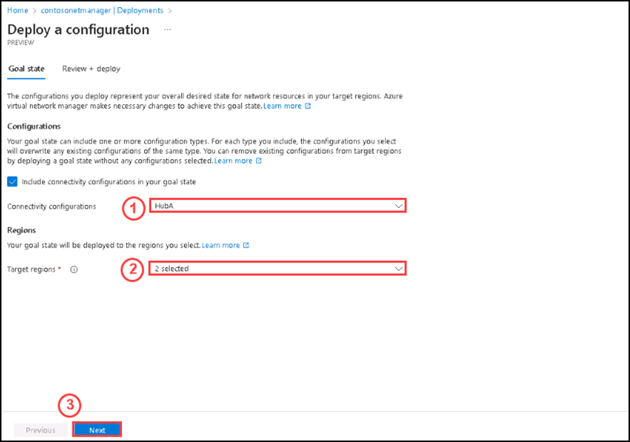
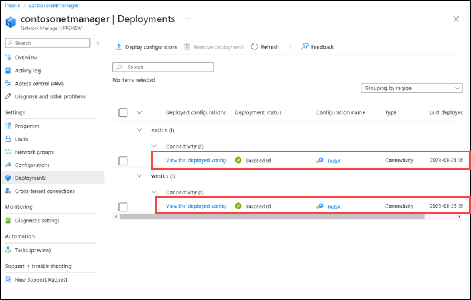

# Instructions

## Exercise 4: Create a hub and spoke connectivity configuration and Deploy the connectivity configuration

In this Exercise, you will have:

  + Task 1: Create a hub and spoke connectivity configuration
  + Task 2: Deploy the connectivity configuration

### Estimated Timing: 80 minutes

### Task 1: Create a hub and spoke connectivity configuration

Before deploying the connectivity configuration, ensure that the virtual network gateway has been successfully deployed. The deployment will fail if you deploy a hub and spoke configuration with Use the hub as a gateway enabled and there is no gateway.

#### Pre-requisites for this task

Complete Exercise 1 & Exercise 2 & Exercise 3

#### Steps:

1. Go to Network manager named **contosonetmanager**, please select **Configuration** under Settings, then select **+ Create**, then select **Connectivity configuration** from the drop-down menu.

    

2. On the Basics tab, enter and select the following information for the connectivity configuration:

    | Section | Values |
    | ------- | ------ |
    | Name| Enter **HubA** for the name of the configuration |
    | Description | **This configuration contains a hub virtual network in the West US region**. |
  
3. Select Next: Topology >. Select Hub and Spoke under the Topology setting. This will reveal other settings.

    

4. On Topology, Select **Hub and spoke** option, then select **Select a hub** under Hub setting. 

    

5. Then, select **Contoso-Vnet-WestUS** to serve as your network hub and select **Select**.

    

5. Under Spoke network groups, select **+ Add**. Then, select **contosonetworkgrp** for the network group and select **Select**.

    

6. After you've added the network group, select the following options:

    | Section | Values |
    | ------- | ------ |
    | Direct Connectivity| Select the checkbox for **Enable connectivity within network group**. This setting will allow spoke virtual networks in the network group in the same region to communicate with each other directly. |
    | Hub as gateway | Select the checkbox for Use **Hub as a gateway** |
  
    Leave the **Global Mesh** unchecked. This setting isn't required as both spokes are in the same region.
 
    
 
 7. Select **Next: Review + create** > and then create the connectivity configuration.
  
You have Created a hub and spoke connectivity configuration, now you are going to deploy the connectivity configuration.

### Task 2: Deploy the connectivity configuration

Before deploying the connectivity configuration, ensure that the virtual network gateway has been successfully deployed. The deployment will fail if you deploy a hub and spoke configuration with Use the hub as a gateway enabled and there is no gateway. In this task, you are going to deploy the connectivity configuration.

#### Pre-requisites for this task

Complete Exercise 1 & Exercise 2 & Exercise 3 & Exercise 4 - Task 1

#### Steps:

1. On the **contosonetmanager** page, please select **Deployments**, then select **Deploy configuration**.

    

2. On the **Deploy a configuration** page, Select **Include connectivity configurations** (If its already selected please leave in that state) in your goal state and **HubA** as the Connectivity configurations setting. Then select **West US** and **East US** as the target regions and select **Next**.

    

3. Select **Deploy**. You should now see the deployment show up in the list for those regions. The deployment of the configuration can take several minutes to complete

    

### Clean up resources

>**Please do not delete resources you deployed in this lab. You will reference them in the next lab of this module.**

### Review

In this lab, you have:

+ Created a hub and spoke connectivity configuration.
+ Deployed the connectivity configuration.
