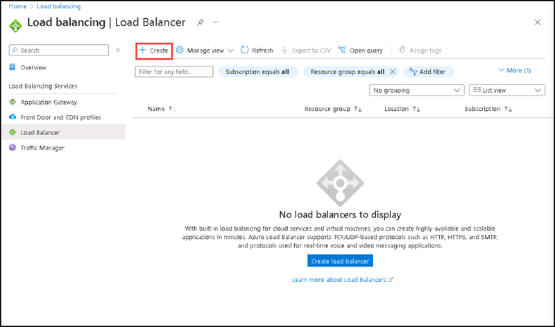

# Instructions

## Exercise 7: Create a Load Balancer and Test the Load balancer

In this exercise, you will use Azure Virtual Networks created on the previous exercise. Deploy a load blanacer 

In this Exercise, you will have:

  + Task 1: Create load balancer.
  + Task 2: Create NAT gateway.
  + Task 3: Create virtual machines.
  + Task 4: Install IIS.
  + Task 5: Test the load balancer.
   
### Task 1: Create load balancer.

In this task, you'll create a zone redundant load balancer that load balances virtual machines. With zone-redundancy, one or more availability zones can fail and the data path survives as long as one zone in the region remains healthy.

During the creation of the load balancer, you'll configure:

+ Frontend IP address
+ Backend pool
+ Inbound load-balancing rules
+ Health probe

#### Pre-requisites for this task

Complete Exercise 1 & Exercise 2 & Exercise 3 & Exercise 4 & Exercise 5 & Exercise 6.

#### Steps:

1. In the search box at the top of the portal, enter **Load balancer**. Select **Load balancers** in the search results.

2. In the **Load balancer** page, select **+ Create**.

3. In the **Basics** tab of the **Create load balancer** page, enter or select the following information:

  | Section | Values |
  | ------- | ------ |
  | Subscription | **Default** Select the default subscription |
  | Resource group | Select **contosovnet** |
  | Name | Enter **contosoLB** for the Load balancer name. |
  | Region | **East US** |
  | SKU | Leave the default **Standard**. |
  | Type | Select **Public** |
  | Tier | Leave the default **Regional** |
    
  
4. Select Next: Frontend IP configuration at the bottom of the page.

5.  In **Frontend IP configuration**, select **+ Add a frontend IP configuration**.

6. On the **Add Frontend IP Configuration** side screen, Enter **contosoIP** in Name box, Select **IPv4** for the IP version, then Select **IP address** for the IP type.

7. Select Create new in Public IP address.

8. In Add a public IP address, enter **contosopublicIP** for Name.

9. Select **Zone-redundant** in Availability zone.

10. Leave the default of **Microsoft Network** for Routing preference.

11. Select Add.

12. Select **Next: Backend pools** at the bottom of the page.

13. In the **Backend pools** tab, select **+ Add a backend pool**.

14. Enter **contosoBackendPool** for Name in Add backend pool.

15. Select **contoso-Vnet-EastUS** in Virtual network.

16. Select **IP Address** for Backend Pool Configuration.

17. Select **Save**.

18. Select **Next: Inbound rules** at the bottom of the page.

19. Under **Load balancing rule** in the Inbound rules tab, select **+ Add a load balancing rule**.

20. In **Add load balancing rule** side screen, please enter or select the following information:

  | Section | Values |
  | ------- | ------ |
  | Name | **contosoHTTPRule** |
  | Frontend IP address | Select **contosoIP** |
  | Backend pool | Select **contosoBackendPool** |
  | Protocol | Select TCP |
  | Port | Enter 80 |
  | Backend port | Enter 80 |
  | Health probe | Select **Create new**. In Name, enter **contosoHealthProbe**. Select **TCP** in Protocol. Leave the rest of the defaults, and select OK. |
  | Session persistence | Select **None** |
  | Idle timeout (minutes) | Enter or select 15 |
  | TCP reset | Select **Enabled** |
  | Floating IP | Select **Disabled** |
  | Outbound source network address translation (SNAT) | Leave the default of **(Recommended) Use outbound rules to provide backend pool members access to the internet** |
  
21. Select **Add** on the **Add load balancing rule** side screen.

22. Select the **Review + create** button at the bottom of the **Create load blanacer**page, then select **Create**.

23. After completing the deployment, please select **Go to resource**.

You can see the newly created Load balancer named **ContosoLB**.

