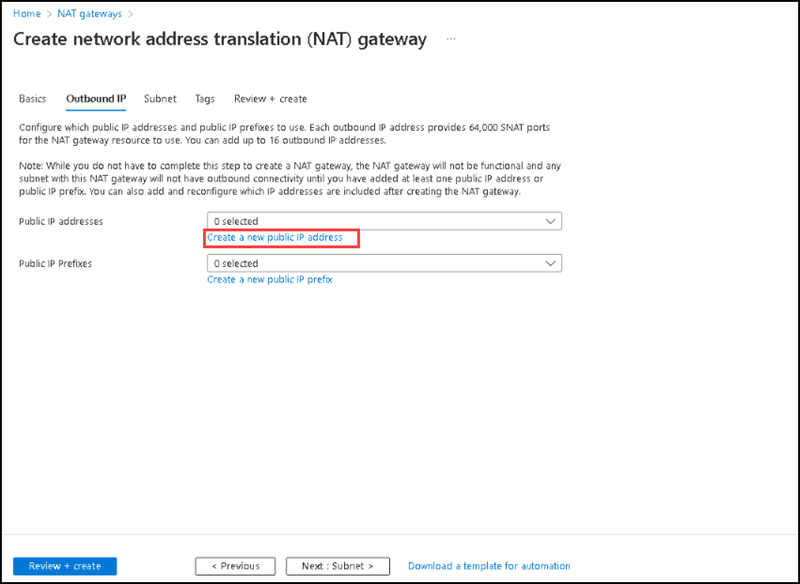
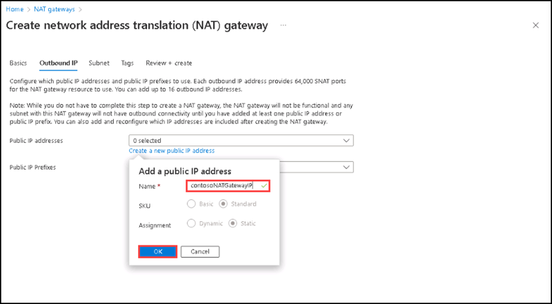
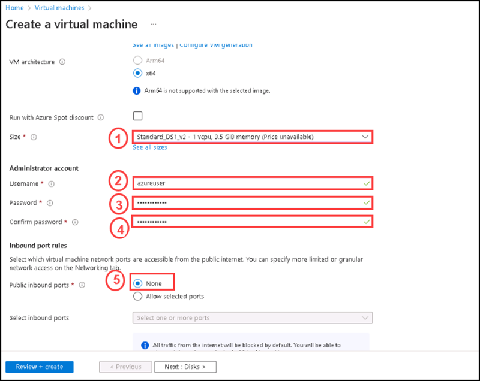
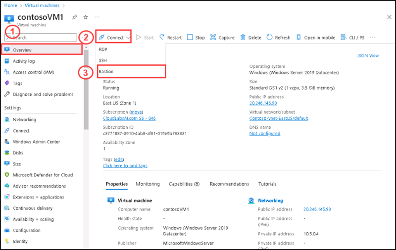
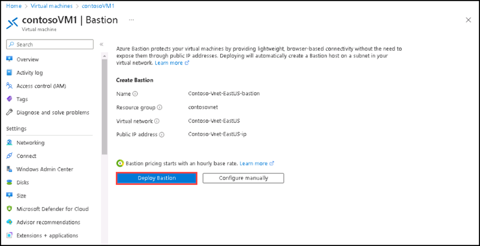
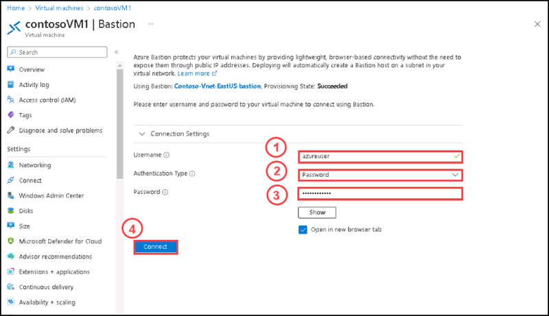
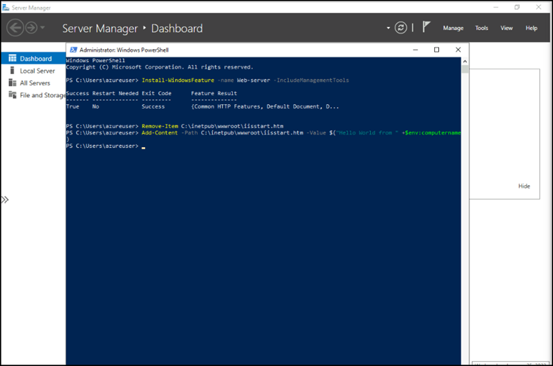
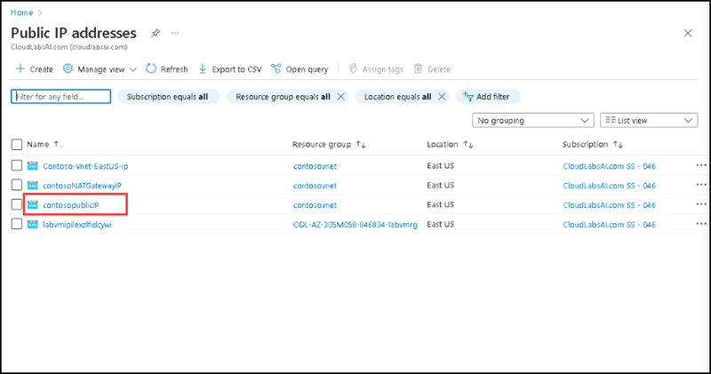
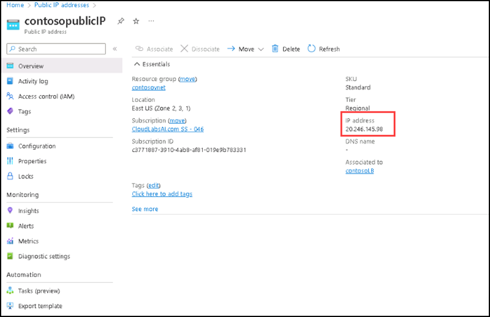
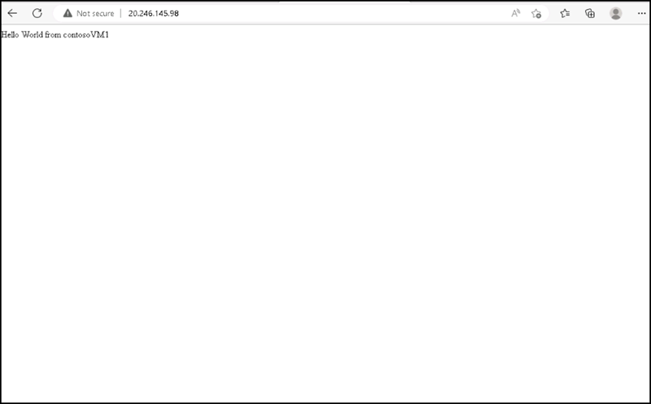

# Instructions

## Exercise 7: Create a Load Balancer and Test the Load balancer

In this exercise, you will use Azure Virtual Networks created on the previous exercise to deploy a load balancer and test it.

In this Exercise, you will:

  + Task 1: Create load balancer.
  + Task 2: Create NAT gateway.
  + Task 3: Create virtual machines.
  + Task 4: Install IIS.
  + Task 5: Test the load balancer.

### Estimated Timing: 70 minutes

### Task 1: Create load balancer.

In this task, you'll create a zone redundant load balancer that load balances virtual machines. With zone-redundancy, one or more availability zones can fail and the data path survives as long as one zone in the region remains healthy.

During the creation of the load balancer, you'll configure:

+ Frontend IP address
+ Backend pool
+ Inbound load-balancing rules
+ Health probe

#### Steps:

1. In the search box at the top of the portal, enter **Load balancer**. Select **Load balancers** in the search results.

2. In the **Load balancers** page, select **+ Create**.

    

3. In the **Basics** tab of the **Create load balancer** page, enter or select the following information:

    | Section | Values |
    | ------- | ------ |
    | Subscription | **Default** Select the default subscription |
    | Resource group | Select **contosovnet** |
    | Name | Enter **contosoLB** for the Load balancer name. |
    | Region | **East US** |
    | SKU | Leave the default **Standard**. |
    | Type | Select **Public** |
    | Tier | Leave the default **Regional** |
    
  
4. Select **Next: Frontend IP configuration >** at the bottom of the page.

5.  In **Frontend IP configuration**, select **+ Add a frontend IP configuration**.

6. On the **Add Frontend IP Configuration** side screen, Enter **contosoIP** in Name box, Select **IPv4** for the IP version, then Select **IP address** for the IP type.

7. Select **Create new** in Public IP address.

8. In Add a public IP address, enter **contosopublicIP** for Name.

9. Select **Zone-redundant** in Availability zone.

10. Leave the default of **Microsoft Network** for Routing preference.

11. Select Add.

12. Select **Next: Backend pools >** at the bottom of the page.

13. In the **Backend pools** tab, select **+ Add a backend pool**.

14. Enter **contosoBackendPool** for Name in Add backend pool.

15. Select **contoso-Vnet-EastUS** in Virtual network.

16. Select **NIC** for Backend Pool Configuration.

17. Select **Save**.

18. Select **Next: Inbound rules >** at the bottom of the page.

19. Under **Load balancing rule** in the Inbound rules tab, select **+ Add a load balancing rule**.

20. In **Add load balancing rule** side screen, please enter or select the following information:

    | Section | Values |
    | ------- | ------ |
    | Name | **contosoHTTPRule** |
    | Frontend IP address | Select **contosopublicIP** |
    | Backend pool | Select **contosoBackendPool** |
    | Protocol | Select TCP |
    | Port | Enter 80 |
    | Backend port | Enter 80 |
    | Health probe | Select **Create new**. In Name, enter **contosoHealthProbe**. Select **TCP** in Protocol. Leave the rest of the defaults, and select OK. |
    | Session persistence | Select **None** |
    | Idle timeout (minutes) | Enter or select 15 |
    | TCP reset | Select **Enabled** |
    | Floating IP | Select **Disabled** |
    | Outbound source network address translation (SNAT) | Leave the default of **(Recommended) Use outbound rules to provide backend pool members access to the internet** |
  
21. Select **Add** on the **Add load balancing rule** side screen.

22. Select the **Review + create** button at the bottom of the **Create load blanacer** page. Once the validation is passed click on **Create**.

23. After deployement is succeeded, select **Go to resource**.

You can see the newly created Load balancer named **ContosoLB**.

   
### Task 2: Create NAT gateway

In this task, you'll create a NAT gateway for outbound internet access for resources in the virtual network. 

#### Steps:

1. In the search box at the top of the portal, enter **NAT gateway**. Select **NAT gateways** in the search results.

2. In NAT gateways, select **+ Create**.

    

3. In **Create network address translation (NAT) gateway**, enter or select the following information:

    | Section | Values |
    | ------- | ------ |
    | Subscription | Default subscription |
    | Resource group | Select **contosovnet** |
    | NAT gateway name | **contosoNatGateway** |
    | Region | **East US** |
    | Availability zone | **None** |
    | Idle timeout (minutes) | **15** |

    

4. Select the **Outbound IP** tab or select **Next: Outbound IP >** at the bottom of the page.

5. In **Outbound IP**, select **Create a new public IP address** next to Public IP addresses.
  
    

6. Enter **contosoNATgatewayIP** in Name, then select **Ok**.

    

7. Select the **Subnet** tab or select the **Next: Subnet >** button at the bottom of the page

8. In **Virtual network** in the Subnet tab, select **contoso-Vnet-EastUS** and click on **default** under **Subnet name**.

9. Select the **Review + create** button at the bottom of the page.

10. Once the validation is passed, select **Create**.

11. After the deployment is succeeded, select **Go to resource**.

You can see the **contosoNatGateway** under the **Resources** list of **contosovnet** resource group's **Overview** section.

### Task 3: Create virtual machines

In this task, you'll create two Virtual machines (contosoVM1 and contosoVM2) in two different zones (Zone 1, and Zone 2).

These VMs are added to the backend pool of the load balancer that was created earlier. 

#### Steps:

1. In the search box at the top of the portal, enter **Virtual machine**. Select **Virtual machines** in the search results.

2. In Virtual machines, select **+ Create > Azure virtual machine**.

3. In **Create a virtual machine**, enter or select the following values in the **Basics** tab:

    | Section | Values |
    | ------- | ------ |
    | Subscription | Default subscription |
    | Resource group | Select **contosovnet** |
    | Virtual machine name | **contosoVM1** |
    | Region | **East US** |
    | Availability Options | Select **Availability zones** |
    | Availability zone | Select **Zone 1** |
    | Security type | Select **Standard** |
    | Image | Select **Windows Server 2019 Datacenter-X64-Gen2** |
    | Azure Spot instance | Leave the default of unchecked. |
    | Size | Select **Standard_DS1-V2 - 1 -vcpu, 3.5 Gib memory** |
    | User name | **azureuser** |
    | Password | **Pa$$w0rd123!** |
    | Confirm Passowrd | **Pa$$w0rd123!** |
    | Public inbound ports | Select **None** |
  
     
    
  
4. Select **Next: Disks >**, then for **OS Disk type** select **Standard SSD**, then select the **Networking** tab or  **Next: Networking >**.

5. In the **Networking** tab, select or enter the following information:

    | Section | Values |
    | ------- | ------ |
    | Virtual network | Select **contoso-Vnet-EastUS** |
    | Subnet | Select **default** |
    | Public IP | Select **None** |
    | NIC network security group | Select **Advanced** |
    | Configure network security group | Skip this setting until the rest of the settings are completed. Complete after **Select a backend pool**. |
    | Delete NIC when VM is deleted | Leave the default of **unselected**. |
    | Enable accelerated networking | Leave the default of **selected**. |
    | Place this virtual machine behind an existing load balancing solution? | Select **Checked** |
    | Load-balancing options | Select **Azure load balancer** |
    | Select a load balancer | Select **contosoLB** |
    | Select a backend pool | Select **contosoBackendPool** |
    | After entered all options above please go to **Configure network security group** | Select **Create new**. In the Create network security group, enter **contosoNSG** in Name. Under Inbound rules, select **+Add an inbound rule**. On the side screen, under Service, select **HTTP**. Under Priority, enter **100**. In Name, enter **contosoNSGRule**. Select **Add**. Select **OK** |
  
6. Select **Review + Create**, then select **Create**.

You have created contosoVM1 virtual machine.

7. Follow the steps 1 through 6 to create another VM with the following values and all the other settings the same as contosoVM1: 

    | Section | Values |
    | ------- | ------ |
    | Virtual machine name | **contosoVM2** |
    | Availability zone | **Zone 2** |
    | Network security group | Select the existing **contosoNSG** |
  
  You have created contosoVM2 virtual machine.
  
 ### Task 4: Install IIS

In this task you are going to install IIS server to the newly created virtual machine.

#### Steps:

1. Select the Virtual machine **contosoVM1**.

2. On the **Overview** page, select **Connect**, then **Bastion**.

    

3. Select **Deploy Bastion**. It will take several minutes to deploy bastion.

    

4. Once the deployment is completed, enter contosoVM1 username : **azureuser**, password: **Pa$$w0rd123!**, and keep **authentication type** as **Password** then select **connect**. 

    


5. Once contosoVM1 opens in the browser, please open the **Powershell** and enter the following scripts:

    In the PowerShell Window, run the following commands to:

    + Install the IIS server
    + Remove the default iisstart.htm file
    + Add a new iisstart.htm file that displays the name of the VM:

    ```powershell
    # Install IIS server role
    Install-WindowsFeature -name Web-Server -IncludeManagementTools

    # Remove default htm file
    Remove-Item  C:\inetpub\wwwroot\iisstart.htm

    # Add a new htm file that displays server name
    Add-Content -Path "C:\inetpub\wwwroot\iisstart.htm" -Value $("Hello World from " + $env:computername)
    ```

    

6. Close the Bastion session with contosoVM1.

 
 ### Task 5: Test the load balancer

In this task, you are going to test the load balnacer deployed on the previous tasks.

#### Steps:

1. In the search box at the top of the page, enter Public IP. Select **Public IP addresses** in the search results.

2. In Public IP addresses, select **contosoPublicIP**.

    

3. Copy the **IP address** and paste the it into the address bar of your browser. 

    

4. The custom VM page of the IIS Web server is displayed in the browser.

    

You have successfully tested the Load balancer.

    
#### Review

In this lab, you have:

- Deployed a Load balancer.
- Configured a Nat gateway.
- Created two virtual machines.
- Install IIS on the newly created virtual machine.
- Tested the Load balancer.
