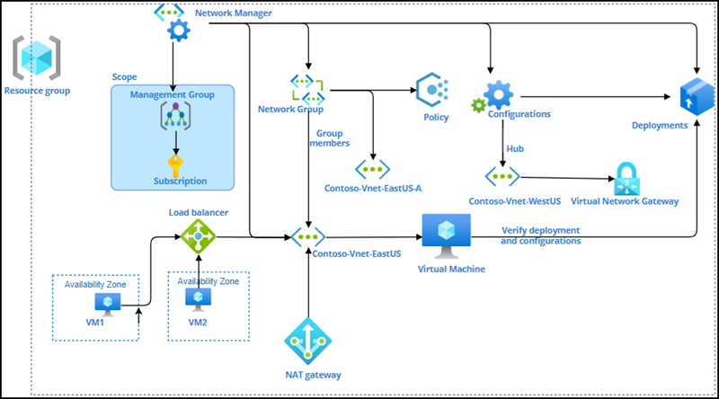

# Lab 06 - Design and deploy a hub and spoke network solution including Load balancer 
# Student lab manual

## Lab scenario

To efficiently manage communication between virtual networks also wants to avoid Azure subscription limitations, you have been tasked with implementing the following functionalities:

- Create a virtual network manager. Azure Virtual Network Manager is a management service that lets you group, configure, deploy, and manage virtual networks across subscriptions on a global scale. You can define network groups in Virtual Network Manager to identify and logically segment your virtual networks. Then you can select the desired connectivity and security configurations and apply them to all of the selected virtual networks in network groups at the same time.

- Create virtual networks and deploy a virtual network gateway. Azure virtual networks allow Azure resources to communicate securely with one another, the internet, and on-premises networks. A virtual network can be used to communicate Azure resources with the internet, communicate between Azure resources, communicate with on-premises resources, filter network traffic, route network traffic, and integrate with Azure services. Azure VPN Gateway is a service that uses a specific type of virtual network gateway to send encrypted traffic over the public Internet between an Azure virtual network and on-premises locations.

- Create a dynamic network group. Azure Policy is a service that allows you to scale per-resource governance. In contrast to explicit lists of virtual networks, it can be used to specify conditional expressions that define group membership. This condition will continue to dynamically power your network groups, allowing virtual networks to join and leave the group as their fulfillment of the condition changes, with no Network Manager intervention required.

- Create a hub and spoke connectivity configuration and deploy the connectivity configuration. A hub and spoke networking model is used to manage common communication or security requirements efficiently. It also aids in avoiding Azure subscription restrictions.

- Create security configuration and Deploy the security admin configuration. A security admin rule enables you to enforce security policy criteria that match the conditions you've specified. Only resources within the scope of the Azure Virtual Network Manager instance can have security administrative rules defined. These security rules take precedence over network security group (NSG) rules and will be evaluated first. 

- Verify deployment of configurations. After completing the deployment you will verify it from a virtual network and a virtual machine.

- Create a Load Balancer and Test the Load balancer. You are going to deploy a public load balancer to provide outbound connections for virtual machines (VMs) inside your virtual network. These connections are accomplished by translating their private IP addresses to public IP addresses. Public Load Balancers are used to load balance internet traffic to your VMs. Finally you will test the Load balancer.

## Objectives

In this lab, you will:

+ Exercise 1: Create a Virtual Network Manager
+ Exercise 2: Create virtual networks and deploy a virtual network gateway
+	Exercise 3: Create a dynamic network group
+	Exercise 4: Create a hub and spoke connectivity configuration and Deploy the connectivity configuration
+	Exercise 5: Create security configuration and Deploy the security admin configuration
+	Exercise 6: Verify deployment of configurations
+	Exercise 7: Create a Load Balancer and Test the Load balancer

## Estimated timing: 360 minutes
## Solution Architecture

  
