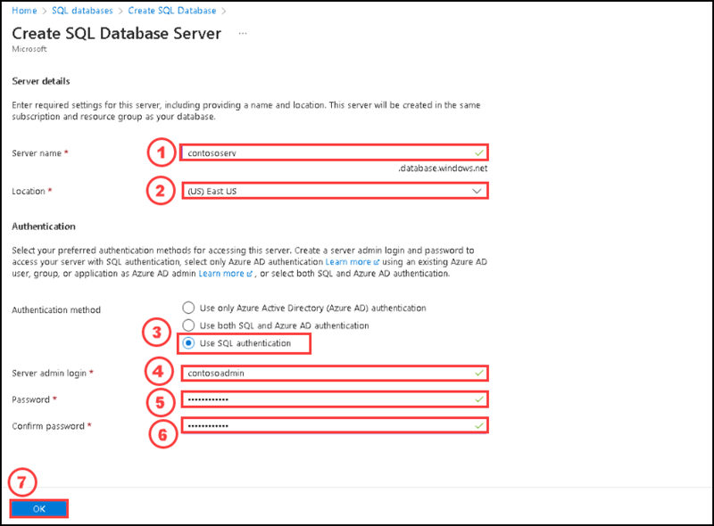
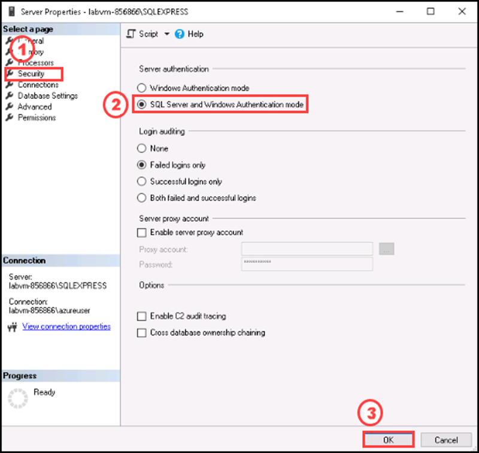
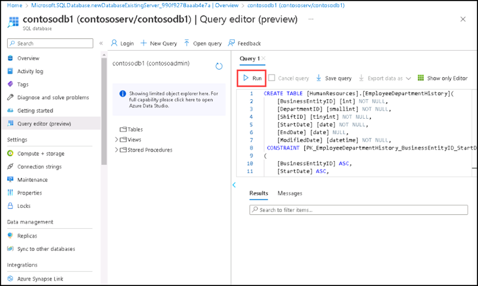
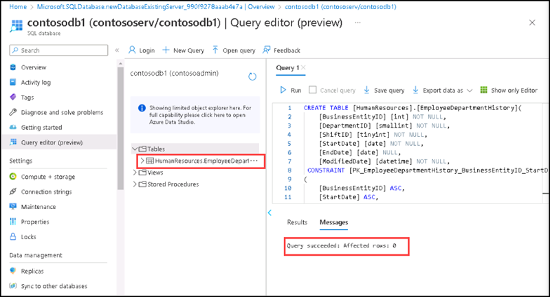
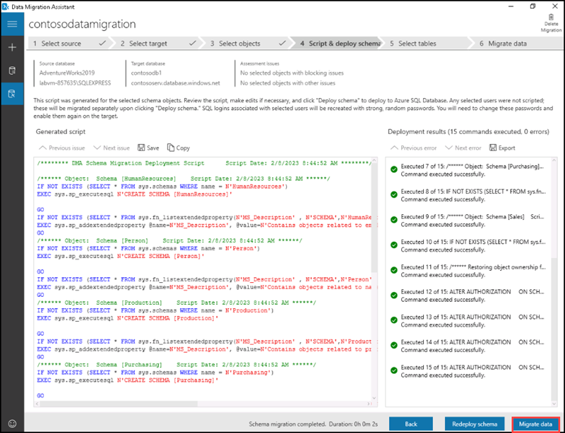

# Instructions

## Exercise 1: Migrate SQL Server database to Azure

In this exercise, you will:

+ Task 1: Create an Azure SQL database
+ Task 2: Set up server-level firewall rules using Azure Portal
+ Task 3: Install the Data Migration Assistant (DMA) on Windows
+ Task 4: Use the Data Migration Assistant to prepare for migration from SQL Server to Azure SQL Database
+ Task 5: Use Data Migration Assistant to migrate Schema and Data

### Estimated Timing:  minutes

### Task 1: Create an Azure SQL database

In this task, you will learn how to create an Azure SQl database by using Azure portal.

#### Pre-requisites for this task

An Azure account

#### Steps

1. In the home page of Azure portal, please enter **SQL database** on the search bar and select **SQL database** from the list.

2. On the SQL databases page, please select **+ Create**.


3. On the **Create SQL Database** please enter the following informations.

    | Settings | Values |
    |  -- | -- |
    | Subscription | **Use default supplied** |
    | Resource group | **ODL-AZ-305M05D-XXXXX-AZ-305M05D** |
    | Database name | **contosodb1** |


4. 4. For server, click **Create new**.

5. On **Create SQL Database Server** page, please enter the following details, then click **Ok**.

    | Settings | Values |
    |  -- | -- |      
    | Server name | **contososerv** |
    | Location | **East US** |
    | Authentication method | **Use SQL authentication** |
    | Server admin login | **contosoadmin** 
    | Password |  **Contoso@123** 
    | Confirm password | **Contoso@123** |    



6. After creating the database server, please enter the following, then select **Review + create**. 

    | Settings | Values |
    |  -- | -- |      
    | Server name | **contososerv** |
    | Want to use SQL elastic pool? | **No** |    |
    | Compute + storage | **General Purpose (Standard-series (Gen5), 2 vCores, 32 GB storage, zone redundant disabled)** |
    | Backup storage redundancy |  **Locally-redundant backup storage** |


7. After the validation, please select **Create**.

### Task 2: Set up server-level firewall rules using Azure Portal

In this task you will configure Server firewall. Azure SQL Server is protected by server-level firewall rules. As a result, it applies to all underlying Azure SQL Databases. Before reaching the Azure server or database, each connection must pass through the firewall.

#### Pre-requisites for this task

An Azure account, a resource group and an Azure SQL Database 

#### Steps:

1. Please select the database you have created on the previous task. Select **Set Server Firewall** on the **Overview** section.


2. On the Networkinmg page, Please select **Selected Networks**. To add your current IP address to a new server-level firewall rule, select **+ Add your client IP**. This rule has the ability to open Port 1433 for a single IP address or a range of IP addresses, then select **Save**.


3. Go to **contosodb1** database, select **Query Editor** provide the login as **contosoadmin** and Password **Contoso@123** then click **Ok**.

You have successfully logged into the contosodb1 database.

### Task 3: Install the Data Migration Assistant (DMA) on Windows

In this task, you will learn how to install and configure Data Migration Assistant (DMA) on Windows.

#### Pre-requisites for this task

An Azure account

#### Steps
  

1. Open up your web browser, and go to the download page for Microsoft Data Migration Assistant, please click [here](https://www.microsoft.com/en-us/download/details.aspx?id=53595).
    
    > [!NOTE]
    > Follow the steps in this task even if DMA is already installed, to ensure that you are using the latest version of the tool.

2. Confirm that your environment supports the software by checking the requirements list. If its ask for installing .Net Framework 4.8 please click [here](https://dotnet.microsoft.com/en-us/download/dotnet-framework/net48) to download. After downloading it, please go to the download folder and double click on the .Net installer file named **ndp48-web** to install it.

3. To download **DataMigrationAssistant.msi**, select **Download**, and then select **Run**.

4. On the **Welcome** screen, select **Next**.

5. Select **I accept the terms in the License Agreement**, and then select **Next**.

6. Read the **Privacy Statement**, and then select **Install**.

7. If prompted, allow UAC control for this application.

8. To complete install, select **Finish**.

### Task 4: Use the Data Migration Assistant to prepare for migration from SQL Server to Azure SQL Database

1. Select the **Start** button, type **Data Migration**, and then select **Microsoft Data Migration Assistant**.

2. To create a new project, on the left, select **+**.


3. On the **New** page, enter these values, and then select **Create**:

    | Property | Value |
    | --- | --- |
    | Project type | **Assessment** |
    | Project name | **Migration Assessment SQL DB** |
    | Assessment type | Database Engine |
    | Source server type | SQL Server |
    | Target server type | Azure SQL Database |
    
    

4. On the **Options** page, leave the default values, and then select **Next**.

5. On the **Connect to a server** page, enter these values, and then select **Connect**:

    | Property | Value |
    | --- | --- |
    | Server name | **labvm-XXXXXX\SQLEXPRESS** (Please go to SSMS and take the server name from there). |
    | Authentication type | **Windows Authentication** |
    | Encrypt connection | Deselected |
    | Trust server certificate | Selected |

 

6. On the **Add sources** page, select the **AdventureWorks** database, and then select **Add**.

 

7. On the **Select sources** page, select **Start Assessment**.

8. Review the SQL Server feature parity and compatibility issues found. Note how many feature parity issue there are.

 

9. Go to SSMS, right click on the server name, then select **Properties**.


10. On the **Server properties** window, select **Security**, then select **SQL Server and Windows Authentication** mode.



11. Go to **contosodb1** database, then select **Query editor**

12. Login with username as **contosoadmin** and Password as **Contoso@123**

13. Expand the Tables you can see there are no tables listed.

### Task 5: Use Data Migration Assistant to migrate Schema and Data

#### Steps

1. Run **Microsoft Data Migration Assistant** tool, select the **+** New (+) icon, and enter the following details and then select **Create**.

    | Property | Value |
    | --- | --- |
    | Project type | **Migration** |
    | Project name | **contosodatamigration** |
    | Source server type | Select **SQL Server** |
    | Target server type | Select **Azure SQL Database** |
    | Migration scope | Select **Schema and Data** |


2. On the Select Source tab, Select the server name **labvm-XXXXX\SQLEXPRESS**, then select **Windows Authentication** as Authentication type, then select **connect**. 


3. Select **Adventureworks2019**, then select **Next**.

4. Go to **contosodb1** database on azure portal, then on the **Overview** section, please copy the server name **contososerv.database.windows.net**.

5. Go to **Microsoft Data Migration Assistant** tool and on the **Connect to target server** tab on the server name section, paste the contosdb1 server name copied.

6. For the **Authentication type** please select **SQL Server Authentication**, then enter username as **contosoadmin**, and password as **Contoso@123**.

7. Select **Connect**.


8. Select **contosodb1** and then click on **Next**

9. On the **Select Object** tab, please select the **Schema** (By default all the objects are selected, please unselect all other objects except schema).

10. To create the SQL scripts, select **Generate SQL scripts option**.

    

11. On the **Script & Deploy schema** tab please select **Deploy schema**.

    

12. You have successfully migrated the schema, you can see the execution of all the schema queries are successfully completed.

    


13. Go to Azure portal and select the newly created database named **contosodb1**.  Go to the Query Editor and paste the below T-SQL script, then click on **Run** to create a table named **HumanResources.EmployeeDepartmentHistory**.

    ```T-SQL
    CREATE TABLE [HumanResources].[EmployeeDepartmentHistory](
	[BusinessEntityID] [int] NOT NULL,
	[DepartmentID] [smallint] NOT NULL,
	[ShiftID] [tinyint] NOT NULL,
	[StartDate] [date] NOT NULL,
	[EndDate] [date] NULL,
	[ModifiedDate] [datetime] NOT NULL,
    CONSTRAINT [PK_EmployeeDepartmentHistory_BusinessEntityID_StartDate_DepartmentID] PRIMARY KEY CLUSTERED 
    (
	[BusinessEntityID] ASC,
	[StartDate] ASC,
	[DepartmentID] ASC,
	[ShiftID] ASC
    )WITH (PAD_INDEX = OFF, STATISTICS_NORECOMPUTE = OFF, IGNORE_DUP_KEY = OFF, ALLOW_ROW_LOCKS = ON, ALLOW_PAGE_LOCKS = ON, OPTIMIZE_FOR_SEQUENTIAL_KEY = OFF) ON         [PRIMARY]
    ) ON [PRIMARY]
    GO
    ```



15. You have successfully created the table named **HumanResources.EmployeeDepartmentHistory**. Expand the Tables and you can see the newly created table.




You are going to migrate from on-premises database Adventureworks2019 table named **HumanResources.EmployeeDepartmentHistory** data to Azure SQL database named **contosodb1** and the  table named **HumanResources.EmployeeDepartmentHistory**.

16. Go to **Microsoft Data Migration Assistant** tool, then select **Migrate data**.



17. On the **Select tables** tab, select **HumanResources.EmployeeDepartmentHistory** table, then select **Start data migration**. 


18. You will get a successfull message on **Migrate data** tab.


