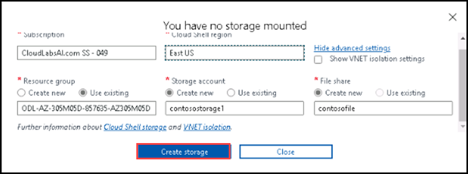
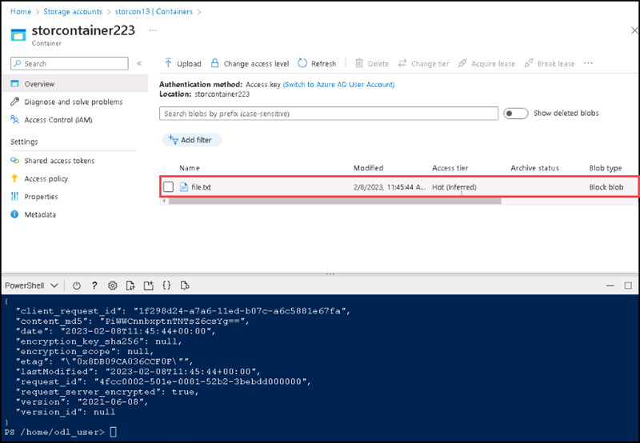

# Instructions

## Exercise 3: Migrate a blob data to Azure storage account.

In this exercise you will create a storage account and upload a blob file by using powershell script.

In this exercise, you will:

+ Task 1: Create an Azure Storage account and upload a blob file to azure storage by using Powershell script

### Estimated Timing: 30 minutes

### Task 1: Create an Azure Storage account and upload a blob file to azure storage by using Powershell script

In this task, you will learn how to create an Azure Storage account via azure portal.

#### Steps

1. Go to Azure portal, Select **Cloudshell** from the top.

   

2. Select **Powershell**, then click on **Show Advanced settings**.

   

3. Enter the following informations, then select **Create storage**.

   | Section | values |
   | ------- | ------ |
   | Subscription | Select the default subscription |
   | Resource group | Select **ODL-AZ-305M05D-<inject key="Deployment-id"></inject>-AZ305M05D** |
   | Storage account name | **contosostr<inject key="Deployment-id"></inject>** |
   | Region | **East US** |
   | File share | **contosofile1** |

9. After opening Powershell terminal, enter the following script and hit enter to create a file to upload to a block blob.

>**Note**: You will need to replace the **XXXXXX** with the **<inject key="Deployment-id"></inject>** mentioned in environment tab and **subscription-ID** with actual **Subscription ID**.

  ```Powershell
     az storage account create --name storconXXXXX --resource-group ODL-AZ-305M05D-XXXXX-AZ305M05D --location EastUS --sku Standard_LRS --encryption-services blob
     
     az role assignment create --role "Storage Blob Data Contributor" --assignee odl_user_XXXXXX@cloudlabsai.com --scope "/subscriptions/subscription-ID/resourceGroups/ODL-AZ-305M05D-XXXXXX-AZ305M05D/providers/Microsoft.Storage/storageAccounts/storconXXXXX"
   ```
10. Open a notepade and type **Hello World**, then save it as **file.txt**.

11. On the Powershell terminal, click on **Upload**, select the file **file.txt** from the saved location, then click on **Open** to upload the file. You will get a message showing it is Successfully Uploaded.

12. On the Powershell terminal, run the following script.

  ```Powershell
  az storage container create --account-name storconXXXXX --name storcontainer123 --auth-mode login
  
  az storage blob upload --account-name storconXXXXX --container-name storcontainer123 --name file.txt --file file.txt --auth-mode login
  ```
  
13. Once the script execution is completed, go to **Storage accounts**. Select **storcon13**, then select the **Container** under **Data Storage** named **storcontainer123**. You can see the uploaded file **file.txt** there.
  
    
   
#### Review

In this lab, you have:

- Created an Azure Storage account and uploaded a blob file to azure storage by using Powershell script
