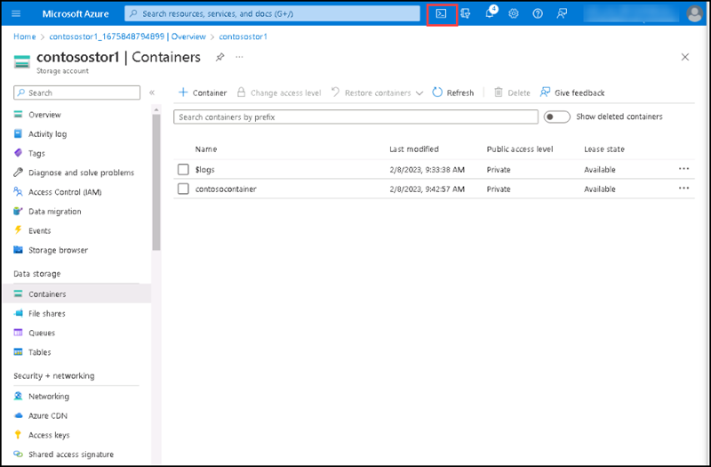

# Instructions

## Exercise 3: Migrate a blob data to Azure storage account.

In this exercise, you will:

+ Task 1: Create an Azure Storage account
+ Task 2: Set up server-level firewall rules using Azure Portal
+ Task 3: Install the Data Migration Assistant (DMA) on Windows
+ Task 4: Use the Data Migration Assistant to prepare for migration from SQL Server to Azure SQL Database
+ Task 5: Use Data Migration Assistant to migrate Schema and Data

### Estimated Timing:  minutes

### Task 1: Create an Azure Storage account

In this task, you will learn how to create an Azure Storage account via azure portal.

#### Pre-requisites for this task

An Azure account

#### Steps

1. Go to Azure portal, Select **Cloudshell** from the top.



2. Select **Powershell**, then select **Show Advanced settings**.


3. Enter the following informations, then select **Create storage**.

  | Section | values |
  | ------- | ------ |
  | Subscription | Select the default subscription |
  | Resource group | Select **ODL-AZ-305M05D-XXXXXX-AZ305M05D** |
  | Storage account name | **contosostr2** |
  | Region | **East US** |
  | File share | **contosofile1** |

9. After opening Powershell terminal please enter the following script and press enter to create a file to upload to a block blob.

  ```Powershell
     az storage account create --name storcon13 --resource-group ODL-AZ-305M05D-XXXXX-AZ305M05D --location EastUS --sku Standard_LRS --encryption-services blob
     
     az role assignment create --role "Storage Blob Data Contributor" --assignee odl_user_XXXXXX@cloudlabsai.com --scope "/subscriptions/<subscription-ID>/providers/Microsoft.Storage/storageAccounts/storcon13"
   ```
10. Open a notepade and type **Hello World**, then save it as **file.txt**.

11. On the Powershell terminal click on **Upload** then select the file **file.txt** from the saved location, then Upload. You will get a message shows Successfully Uploaded.

12. On the Powershell terminal please enter the following script.

  ```Powershell
  az storage container create --account-name storcon13 --name storcontainer123 --auth-mode login
  
  az storage blob upload --account-name storcon13 --container-name storcontainer223 --name file.txt --file file.txt --auth-mode login
  ```
  
13. After successfully run the script, please got **Storage accounts** , then select **storcon13**, then select the **container** named **storcontainer223**. You can see the uploaded file **file.txt** there.
  

  
