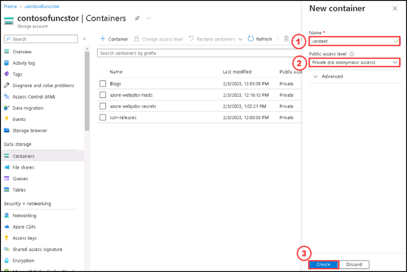
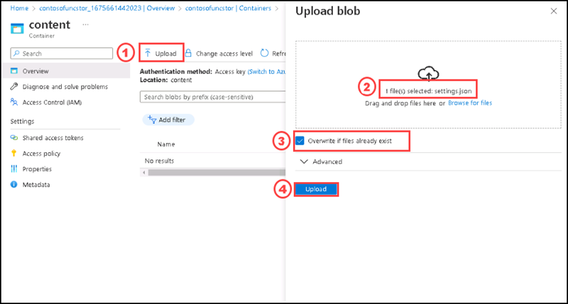
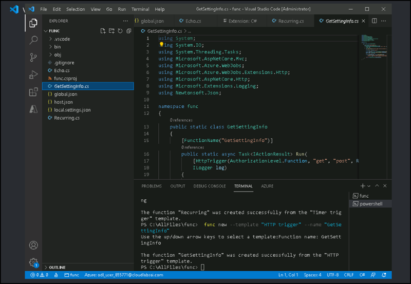
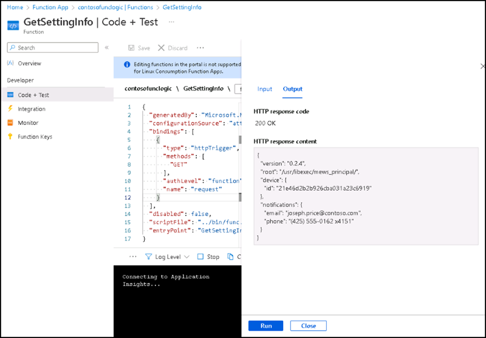

# Instructions

## Exercise 5: Create a function that integrates with other services and Deploy Local project to an Azure function app

In this exercise, you are going to create a local project that you'll use for Azure Functions development and deploy the local project to an azure function app.

In this Exercise, you will have:

  + Task 1: Upload sample content to Azure Blob Storage.
  + Task 2: Configure a connection string.
  + Task 3: Build and validate a project.
  + Task 4: Register Azure Storage Blob extensions.
  + Task 5: Deploy using the Azure Functions Core Tools.
  + Task 6: Validate deployment

### Estimated Timing: 100 minutes

### Task 1: Upload sample content to Azure Blob Storage

In this task, you will upload a JSON file.

#### Pre-requisites for this task

Completed Exercise 1 & Exercise 2 & Exercise 3 & Exercise 4

#### Steps:

1. On the Azure portal go to the **contosofuncstor** storage account that you created previously in this lab.

1. On the **Storage account** blade, select the **Containers** link in the **Data storage** section.

1. In the **Containers** section, select **+ Container**.

    

1. In the **New container** side screen, perform the following actions, and then select **Create**:

    | Section | Values |
    | -- | -- |
    | Name | Enter **content** |
    | Public access level | Select **Private (no anonymous access)** |

    

1. Open a Notepad, enter the following JSON script and save it as settings.json.

    ```JSON
    {
    "version": "0.2.4",
    "root": "/usr/libexec/mews_principal/",
    "device": {
        "id": "21e46d2b2b926cba031a23c6919"
    },
    "notifications": {
        "email": "joseph.price@contoso.com",
        "phone": "(425) 555-0162 x4151"
    }
    }
    ```


1. Return to the **Containers** section, and then select the recently created **content** container.
1. On the **Container** blade, select **Upload**.
1. In the **Upload blob** window, perform the following actions, and then select **Upload**:

    | Setting | Action |
    | -- | -- |
    | **Files** section  | Select the **Folder** icon |
    | **File Explorer** window  | Browse to the location where the file settings.json saved, select the **settings.json** file, and then select **Open** |
    | **Overwrite if files already exist** check box | Ensure that this check box is selected |

    

> **Note**: Wait for the blob to upload before you continue with this lab.

#### Task 2: Create an HTTP-triggered function

In this task, you will create an HTTP triggered function.

#### Pre-requisites for this task

Completed Exercise 1 & Exercise 2 & Exercise 3 & Exercise 4 & Exercise 5 - Task 1 & Task 2

#### Steps:

1. Open **Visual Studio Code**, open new terminal, if the current directory is not **C:\AllFiles\func**
1. Run the following command to change the current directory to the **C:\AllFiles\func** directory:

    ```powershell
    cd C:\AllFiles\func
    ```

1. From the command prompt, run the following command to use the **Azure Functions Core Tools** to create a new function named **GetSettingInfo**, using the **HTTP trigger** template:

    ```powershell
    func new --template "HTTP trigger" --name "GetSettingInfo"
    ```
You have successfully created another C# file named **GetSettingInfo.cs**.

   
  

#### Task 3: Write HTTP-triggered and blob-inputted function code

#### Pre-requisites for this task

Completed Exercise 1 & Exercise 2 & Exercise 3 & Exercise 4 & Exercise 5 - Task 1 & Task 2 & Task 3

#### Steps:

1. On the **Explorer** pane of the **Visual Studio Code** window, open the **GetSettingInfo.cs** file.
1. In the code editor, observe the example implementation:

    ```csharp
    using System;
    using System.IO;
    using System.Threading.Tasks;
    using Microsoft.AspNetCore.Mvc;
    using Microsoft.Azure.WebJobs;
    using Microsoft.Azure.WebJobs.Extensions.Http;
    using Microsoft.AspNetCore.Http;
    using Microsoft.Extensions.Logging;
    using Newtonsoft.Json;    
    namespace func
    {
        public static class GetSettingInfo
        {
            [FunctionName("GetSettingInfo")]
            public static async Task<IActionResult> Run(
                [HttpTrigger(AuthorizationLevel.Function, "get", "post", Route = null)] HttpRequest req,
                ILogger log)
            {
                log.LogInformation("C# HTTP trigger function processed a request.");    
                string name = req.Query["name"];    
                string requestBody = await new StreamReader(req.Body).ReadToEndAsync();
                dynamic data = JsonConvert.DeserializeObject(requestBody);
                name = name ?? data?.name;    
                string responseMessage = string.IsNullOrEmpty(name)
                    ? "This HTTP triggered function executed successfully. Pass a name in the query string or in the request body for a personalized response."
                    : $"Hello, {name}. This HTTP triggered function executed successfully.";    
                return new OkObjectResult(responseMessage);
            }
        }
    }
    ```

1. Delete all the content within the **GetSettingInfo.cs** file.

1. Add the following lines of code to add **using directives** for the **Microsoft.AspNetCore.Http**, **Microsoft.AspNetCore.Mvc**, and **Microsoft.Azure.WebJobs** namespaces:

    ```csharp
    using Microsoft.AspNetCore.Http;
    using Microsoft.AspNetCore.Mvc;
    using Microsoft.Azure.WebJobs;
    ```

1. Create a new **public static** class named **GetSettingInfo**:

    ```csharp
    public static class GetSettingInfo
    { }
    ```

1. Observe the **GetSettingInfo.cs** file again, which should now include the following code:

    ```csharp
    using Microsoft.AspNetCore.Http;
    using Microsoft.AspNetCore.Mvc;
    using Microsoft.Azure.WebJobs;
    public static class GetSettingInfo
    { }
    ```

1. Within the **GetSettingInfo** class, add the following code block to create a new **public static** expression-bodied method named **Run** that returns a variable of type **IActionResult** and that also takes in variables of type **HttpRequest** and **string** as parameters named *request* and *json*:

    ```csharp
    public static IActionResult Run(
        HttpRequest request,
        string json)
        => null;
    ```

    > **Note**: You are only temporarily setting the return value to **null**.

1. Add the following code to append an attribute to the **Run** method of type **FunctionNameAttribute** that has its **name** parameter set to a value of **GetSettingInfo**:

    ```csharp
    [FunctionName("GetSettingInfo")]
    public static IActionResult Run(
        HttpRequest request,
        string json)
        => null;
    ```

1. Add the following code to append an attribute to the **request** parameter of type **HttpTriggerAttribute** that has its **methods** parameter array set to a single value of **GET**:

    ```csharp
    [FunctionName("GetSettingInfo")]
    public static IActionResult Run(
        [HttpTrigger("GET")] HttpRequest request,
        string json)
        => null;
    ```

1. Add the following code to append an attribute to the **json** parameter of type **BlobAttribute** that has its **blobPath** parameter set to a value of **content/settings.json**:

    ```csharp
    [FunctionName("GetSettingInfo")]
    public static IActionResult Run(
        [HttpTrigger("GET")] HttpRequest request,
        [Blob("content/settings.json")] string json)
        => null;
    ```

1. Add the following code to update the **Run** expression-bodied method to return a new instance of the **OkObjectResult** class passing in the value of the **json** method parameter as the sole constructor parameter:

    ```csharp
    [FunctionName("GetSettingInfo")]
    public static IActionResult Run(
        [HttpTrigger("GET")] HttpRequest request,
        [Blob("content/settings.json")] string json)
        => new OkObjectResult(json);
    ```

1. Observe the **GetSettingInfo.cs** file again, which should now include the following code:

    ```csharp
    using Microsoft.AspNetCore.Http;
    using Microsoft.AspNetCore.Mvc;
    using Microsoft.Azure.WebJobs;
    public static class GetSettingInfo
    {
        [FunctionName("GetSettingInfo")]
        public static IActionResult Run(
            [HttpTrigger("GET")] HttpRequest request,
            [Blob("content/settings.json")] string json)
            => new OkObjectResult(json);
    }
    ```

1. Select **Save** to save your changes to the **GetSettingInfo.cs** file.

### Task 4: Register Azure Storage Blob extensions

In this task, you are going to register azure blob storage extension.

#### Pre-requisites for this task

Completed Exercise 1 & Exercise 2 & Exercise 3 & Exercise 4 & Exercise 5 - Task 1 & Task 2 & Task 3

#### Steps:

1. On the terminal, run the following command to register the [Microsoft.Azure.WebJobs.Extensions.Storage](https://www.nuget.org/packages/Microsoft.Azure.WebJobs.Extensions.Storage/) extension:

    ```powershell
    func extensions install --package Microsoft.Azure.WebJobs.Extensions.Storage --version 5.0.1
    ```
Please wait for a while to complete the installation.

2. After that, run the following command to build the .NET project and to validate the extensions were installed correctly:

    ```powershell
    dotnet build
    ```
You will get a Build succeeded message.

### Task 5: Deploy using the Azure Functions Core Tools

#### Pre-requisites for this task

Completed Exercise 1 & Exercise 2 & Exercise 3 & Exercise 4 & Exercise 5 - Task 1 & Task 2 & Task 3 & Task 4

#### Steps:

1. From terminal, run the following command to login to the Azure Command-Line Interface (CLI):

    ```powershell
    az login
    ```

1. In the browser window, enter the name and password of the Microsoft or Azure Active Directory account you are using in this lab, and then select **Sign in**.
1. Return to the currently open **Windows Terminal** window. Wait for the sign-in process to finish.
1. From the terminal, run the following command to publish the function app project (replace the `<function-app-name>` placeholder with the name of the function app you created earlier in this lab):

    ```powershell
    func azure functionapp publish <function-app-name>
    ```

    > **Note**: For example, if your **Function App name** is **funclogicstudent**, your command would be ``func azure functionapp publish contosofunclogic``.

1. Wait for the deployment to finalize before you move forward with the lab.

### Task 6: Validate deployment

In this task, you are going to validate the deployment.

#### Pre-requisites for this task

Completed Exercise 1 & Exercise 2 & Exercise 3 & Exercise 4 & Exercise 5 - Task 1 & Task 2 & Task 3 & Task 4 & Task 5

#### Steps:

1. On the taskbar, select the **Microsoft Edge** icon, and select the tab that displays the Azure portal (<https://portal.azure.com>).
1. On the Azure portal's **navigation** pane, select the **Resource groups** link.
1. On the **Resource groups** blade, select the **Serverless** resource group that you created previously in this lab.
1. On the **Serverless** blade, select the **contosofunclogic** function app that you created previously in this lab.
1. On the **Function App** blade, select the **Functions** option in the **Functions** section.
1. On the **Functions** pane, select the existing **GetSettingInfo** function.
1. In the **Function** blade, select the **Code + Test** option in the **Developer** section.
1. In the function editor, select **Test/Run**.
1. In the automatically displayed pane, in the **HTTP method** drop-down list, select **GET**.
1. Select **Run** to test the function.
1. In the **HTTP response content**, review the results of the test run. The JSON content should now include the following code:

    ```json
    {
        "version": "0.2.4",
        "root": "/usr/libexec/mews_principal/",
        "device": {
            "id": "21e46d2b2b926cba031a23c6919"
        },
        "notifications": {
            "email": "joseph.price@contoso.com",
            "phone": "(425) 555-0162 x4151"
        }
    }
    ```

    

#### Review

In this lab, you have:

- Created a Local project
- Deployed local project into Azure function app.
- Validated the project.

