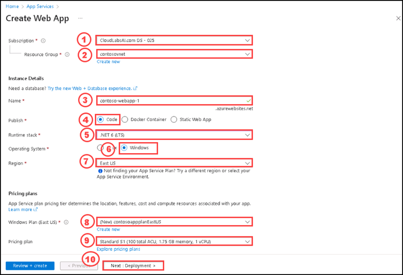
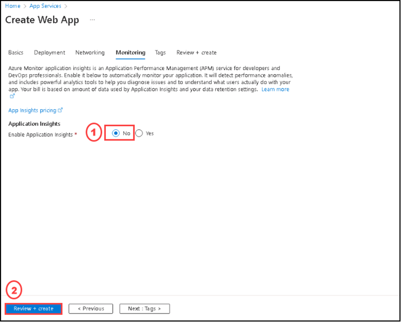
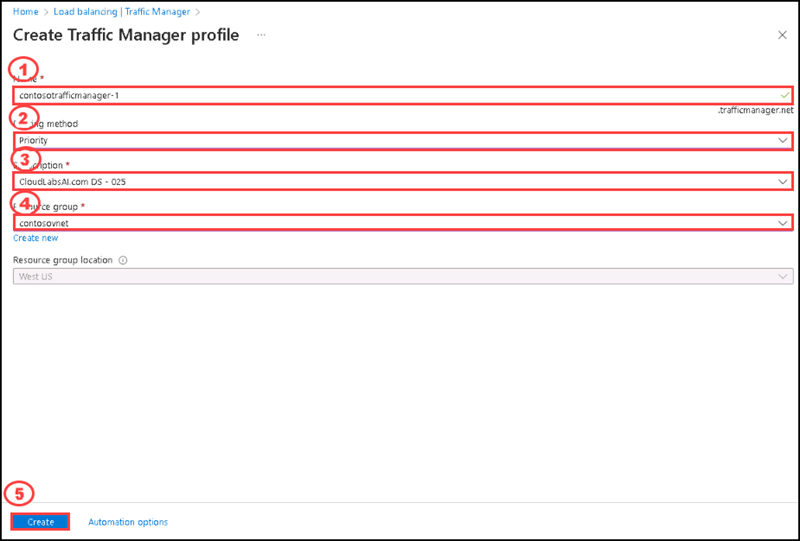
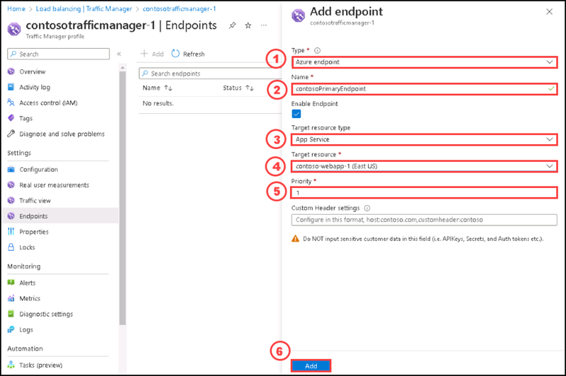
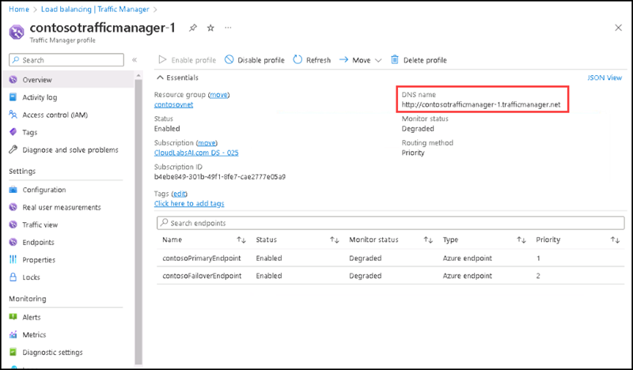
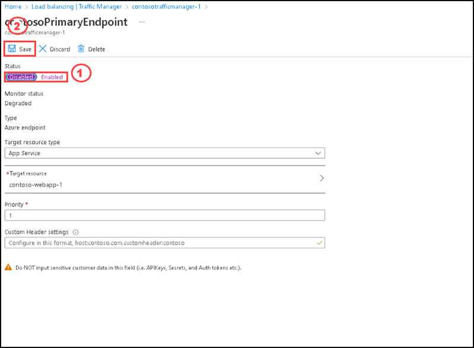
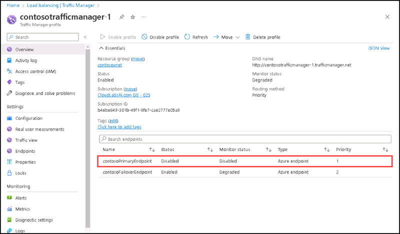

# Instructions

## Exercise 2: Setup Traffic Manager

In this exercise, you are going to deploy a Traffic Manager. Azure Traffic Manager allows you to manage traffic distribution across your application endpoints. Any Internet-facing service hosted inside or outside of Azure is an endpoint.

In this exercise, you will:

+ Task 1: Create two Web Apps
+ Task 2: Create a Traffic Manager profile
+ Task 3: Add Traffic Manager endpoints.
+ Task 4: Test Traffic Manager profile

### Estimated Timing: 60 minutes

### Task 1: Create two Web Apps

In this task you are going to create two Web Apps. One will be in the West US region and the other will be in the East US region.

#### Pre-requisites for this task

Completed Exercise 1

#### Steps:

1. Search for **Web Apps** on the **search** box of the **Home** page, then select **App services** from the list below.

2. On the **App services** page, please select **+ Create**.

3. On the **Create Web App** page please enter the following details on the **Basics** tab and then select **Next: Deployment>** at the bottom.

    | Section | Values |
    | ------- | ------ |
    | Subscription | **Default** Select the default subscription |
    | Resource group | Select **contosovnet** |
    | Name | **contoso-webapp-1** |
    | Publish | **Code** |
    | Runtime stack | Select **.Net 6 (LTS)** |
    | Operating System | Select **Windows** |
    | Region | Select **East US**. |
    | Windows Plan | Select **Create new** and enter **contosoappplanEastUS** in the text box |
    | Pricing plan | Select **Standard S1 (100 total ACU, 1.75 GB memory, 1 vCPU)** |

    

4. On the **Deployment** tab review the default settings and select **Next: Networking>** at the bottom.

5. On the **Networking** tab, please review the default settings and select **Next: Monitoring>** at the bottom.

6. On the **Monitoring** tab, set **Enable Application Insights** to **No** and then select **Review + create**.

    

7. After completing the validation, please select **Create**. When the Web App successfully deploys, it creates a default web site.

8. Follow steps 2-7 to create a second Web App named **contoso-webapp-2**. The Resource Group name is **contosovnet**, with Region of **West US**, and App Service Plan name of **contosoappplanWestUS**. All the other settings are the same as **contoso-webapp-1**.

You have successfully deployed two web apps named **contoso-webapp-1** and **contoso-webapp-2**.

### Task 2: Create a Traffic Manager profile

In this task, Create a Traffic Manager profile that directs user traffic based on endpoint priority

#### Pre-requisites for this task

Completed Exercise 1 & Exercise 2 - Task 1

#### Steps:

1. Go to Home page, and search for **Traffic Manager Profile**, then select **Traffice Manager Profile** from the list.

2.  On the **Load balancing | Traffic Manager** page, please select **+ Create**.

3. On the **Create Traffic Manager Profile** page, please enter the following informations and then select **Create**. 

    | Section | Values |
    | ------- | ------ |
    | Name | **contosotrafficmanager-1**  |
    | Routing method | Select **Priority** |
    | Subscription | **Default** Select the default subscription |
    | Resource group | **contosovnet** |
 
    
 
After completing the deployment, you can see the **contosotrafficmanager-1**.

### Task 3: Add Traffic Manager endpoints

In this task, you are going to add the website in the **East US** as primary endpoint to route all the user traffic. Add the website in **West US** as a failover endpoint. When the primary endpoint is unavailable, traffic automatically routes to the failover endpoint.

#### Steps:

1. In **Load balancing | Traffic Manager** page, select **contosotrafficmanager-1** under **Settings**. The, select **Endpoints**, and click on **+ Add**. 

2. On the **Add Endpoint** side screen, enter the following details and then select **Add**.

    | Section | Values |
    | ------- | ------ |
    | Type | Select **Azure endpoint**  |
    | Name | Enter **contosoPrimaryEndpoint** |
    | Target resource type | Select **App Service** |
    | Target resource | Select **contoso-webapp-1** |
    | Priority | Select **1** |

    

3. To create a failover endpoint for your second Azure region, repeat steps 1 and 2 by entering below details:

    | Section | Values |
    | ------- | ------ |
    | Type | Select **Azure endpoint**  |
    | Name | Enter **contosoFailoverEndpoint** |
    | Target resource type | Select **App Service** |
    | Target resource | Select **contoso-webapp-2** |
    | Priority | Select **2** |

You have successfully added both the endpoints.

### Task 4: Test Traffic Manager profile

In this task, you are going to test the traffic manager profile.

#### Steps: 

1. Go to the **Overview** section of the **Traffic Manager profile** that you created in the preceding Task.

2. Copy the **DNS** name of the **contosotrafficmanager-1**.

    

3. Open a new tab of your browser and enter the DNS name of your Traffic Manager profile to view your Web App's default website.

>**Note:** You might get an error stating **Your connection isn't private**. To see the website click on **Advanced** and then go to **Continue to contosotrafficmanager-1.trafficmanager.net (unsafe)**

    

You can see the Web app running successfully .

To view Traffic Manager failover in action, disable your primary site:

4. In the Traffic Manager Profile page, from the **Overview** section, select **contosoPrimaryEndpoint**.

5. In **contosoPrimaryEndpoint**, select **Disabled** and then select **Save**.

    

6. Close **contosoPrimaryEndpoint** blade. Notice that the **status** is changed to **Disabled** now.

    

7. Copy the DNS name of your Traffic Manager Profile from the preceding step to view the website in a new web browser session.

    

Verify that the web app is still available.

The primary endpoint isn't available, so you were routed to the failover endpoint.

#### Review

In this exercise, you have:

- Created two Web Apps
- Created a Traffic Manager profile
- Added Traffic Manager endpoints.
- Tested Traffic Manager profile

