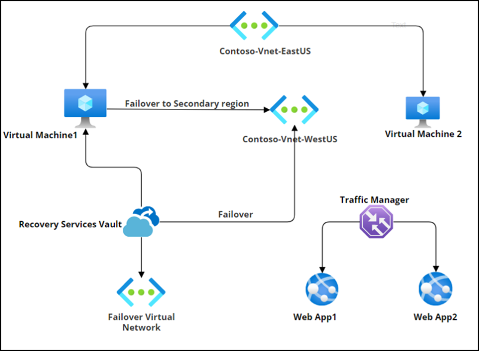

# Lab11 - Implement Compute Disaster Recovery
# Student lab manual

## Lab scenario

As a Cloud administrator you want to implement a secured disaster solution in Contoso Traders. When you enable replication for a Virtual machine in order to enable disaster recovery, the Site Recovery Mobility service extension installs and registers the VM with Azure Site Recovery. Virtual machine disk writes are routed to a cache storage account in the source region during replication. Data is sent from there to the target region, and the data is used to generate recovery points. A recovery point is used to restore a VM in the target region when it fails over during disaster recovery. You are going to do the following tasks to implement a disaster solution in azure testing environment.

- Setup Azure Site Recovery. Site Recovery ensures business continuity by keeping business applications and workloads operational during outages. Site Recovery replicates workloads running on physical and virtual machines (VMs) from one location to another. When your primary site goes down, you fail over to a backup location and access apps from there. You can fail back to the primary location once it is operational again.

- Setup Traffic Manager. Azure Traffic Manager is a traffic load balancer that uses DNS. This service allows you to distribute traffic to your public-facing applications across multiple Azure regions around the world. Traffic Manager also ensures that your public endpoints are always available and respond quickly.

- Validate Disaster Failover for Virtual Machines. You will validate the diaster failover for virtual machines.

## Objectives

In this lab, you will:

+ Exercise 1: Setup Azure Site Recovery
+ Exercise 2: Setup Traffic Manager
+ Exercise 3: Validate Disaster Failover for Virtual Machines

## Estimated timing: 160 minutes
## Solution Architecture

  
